# Hardware Hacking ES Comunidad

- Discord: https://discord.gg/wkWr6Dj46D 
- Telegram: https://t.me/hardwarehackinges


# Hacking Router TP-Link TL-WR841N

### Material Requerido:

- [TP-Link TL-WR841N](https://www.amazon.es/dp/B001FWYGJS?ref=ppx_yo2ov_dt_b_product_details&th=1) 
- Soldador Estaño
- FLux 
- USB a TTL o Buspirate
- Multimetro
- Cable Ethernet o Wifi
- Pines para UART
- Ordenador

## Paso 1: Comprar el router.

El modelo que vamos a analizar es el [TP-Link TL-WR841N V14 ]("TP-Link TL-WR841N")


---
## Paso 2: Abriendo el router.

Lo primero que debemos hacer es quitar los dos tornillos que hay en la parte inferior y después haremos palanca con algún trozo de plástico, yo he usado una púa de guitarra.

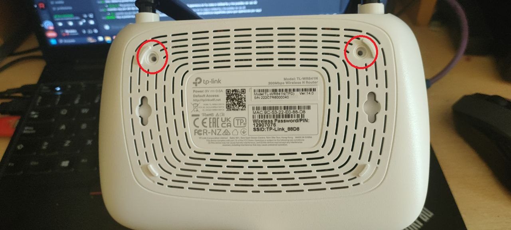


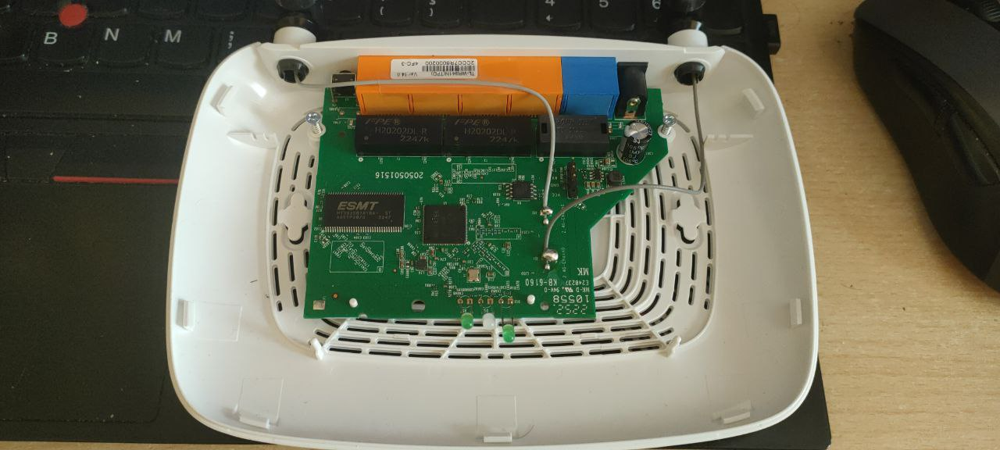

Y ya tendríamos acceso directo a la PCB del router.

---

## Paso 3: Identificar componentes y UART.

Una vez abierto el router hay que identificar todos los componentes posibles.

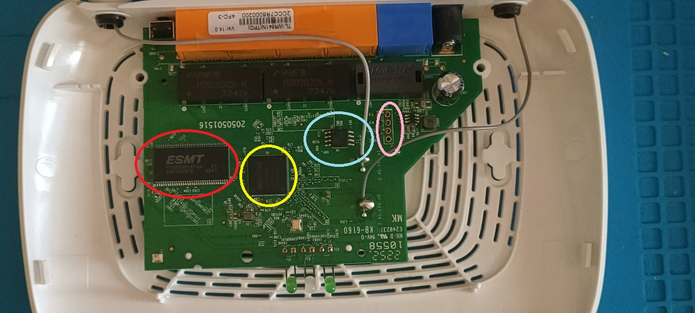

#### Cada circulo es una parte interesante de la pcb para nosotros:

- Circulo Rojo: Es la memoria RAM. Mirando la [ficha técnica](https://openwrt.org/toh/tp-link/tl-wr841nd) de la Versión 14 en OpenWRT podemos ver que tiene 32 MiB.   

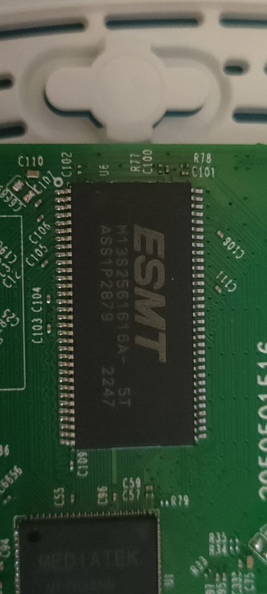

- Circulo Amarillo: Es el SOC (System-On-Chip) MT7628NN.

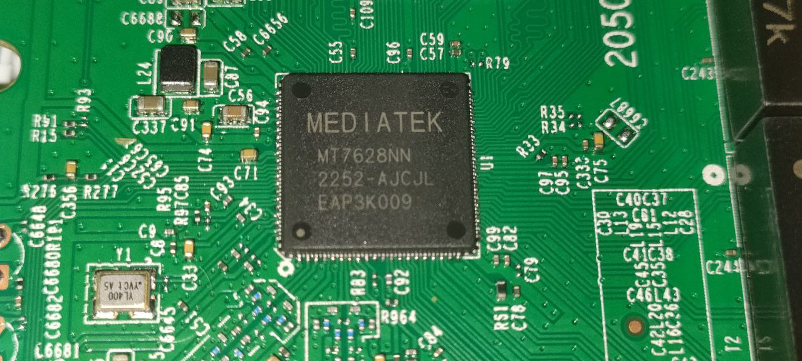

- Circulo Azul: Es la memoria flash EN25Q32(A/B). Aquí es donde se guarda el bootloader y el sistema de archivos etc.

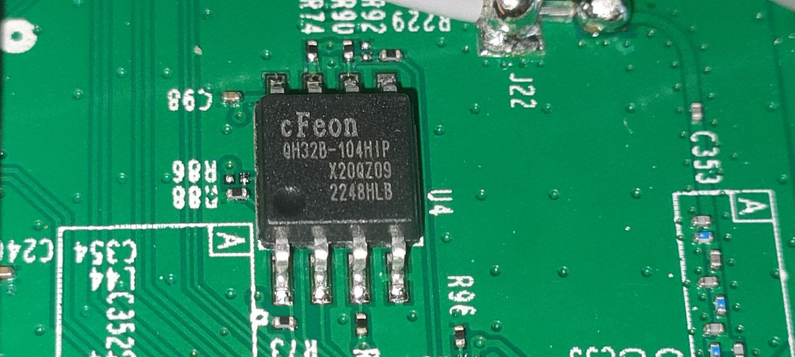

- Circulo Rosa: Es la Interfaz UART que usaremos para obtener terminal de root y obtener el sistema de archivos. La resistencia **R18** bloquea la escritura UART, luego habrá que quitarla. 
 
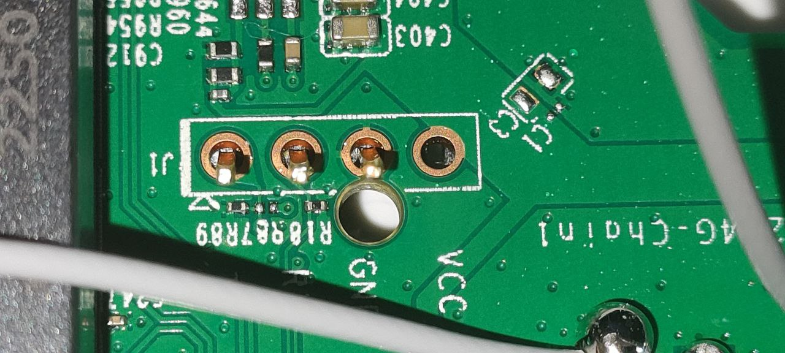

---
## Paso 4: Soldar pines a UART y ELIMINAR R18.

Soldar pines a UART no es complicado simplemente necesitaremos:

- [Soldador de estaño](https://www.amazon.es/Profesional-Temperatura-Ajustable-Desoldadora-Antiest%C3%A1ticas/dp/B09B3GRVTM/ref=sr_1_2_sspa?keywords=soldador+esta%C3%B1o&sr=8-2-spons&sp_csd=d2lkZ2V0TmFtZT1zcF9hdGY&psc=1)
- [Estaño](https://www.electronicaembajadores.com/es/Productos/Detalle/HRJ1121/herramienta/accesorios-y-consumibles-de-soldadura/mbo-soldadura-de-estano-60-sn-40-pb-0-5-mm-250-g-121103) a poder ser de calidad (se notan mucho los acabados.)
- [Pines](https://www.amazon.es/ANGEEK-Single-Breakable-Connector-Arduino/dp/B07XXXNH9V/ref=sr_1_5?__mk_es_ES=%C3%85M%C3%85%C5%BD%C3%95%C3%91&keywords=Pines+pcb&sr=8-5)

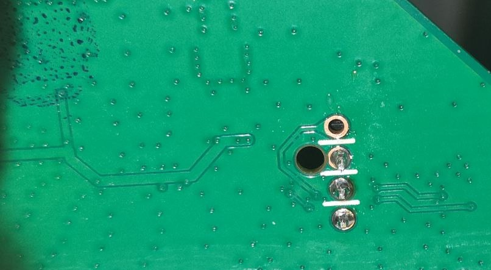

Aqui vemos como se ha eliminado la **R18** que impide la escritura a través de UART y los pines listos para conectarnos. En este caso hemos conectado el RX, el TX y el GND. El VCC no es necesario porque la alimentación la daremos usando el adaptador de corriente del router.

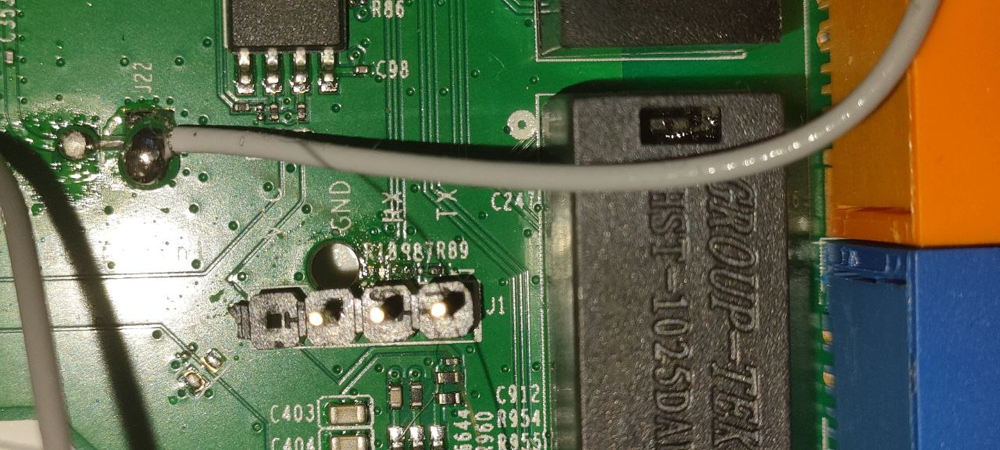

---

## Paso 5: Conectarse al UART.

### Usando USB-to-TTL

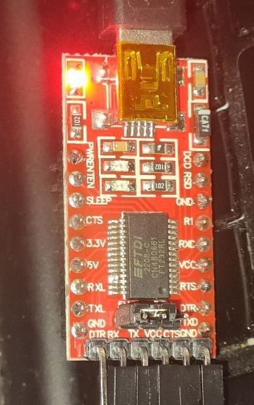

Aqui podemos ver como he conectado todos los pines desde el USB_UART-to-TTL, una cosa IMPORTANTE es que para que funcione la escritura necesitamos que el cable de datos TX vaya a 5V, porque si lo ponemos a 3,3V no funcionara correctamente.

Ahora para conectarnos correctamente lo primero es entender el protocolo [SERIAL](https://learn.sparkfun.com/tutorials/serial-communication) ,lo mas importante es que el pin RX del adaptador TTL-USB tiene que ir al TX del router y el TX del adaptador TTL-USB al RX del router además de conectar los dos GNDs. 


Ahora nos conectaremos usando algun software como TeraTerm o Putty, en mi caso usare TeraTerm.

1. Lo abrimos y seleccionamos la interfaz COM correspondiente del TTL-USB
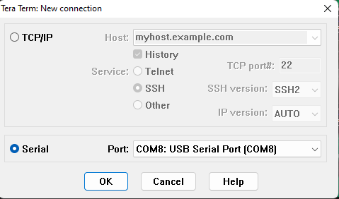
2. Ahora configuramos la interfaz serial dentro de Setup->Serial Port
   
3. Y lo dejamos con esta configuracion de 115200 baudios de velocidad, 8 bits de datos, ninguno de paridad y uno de stop. 
   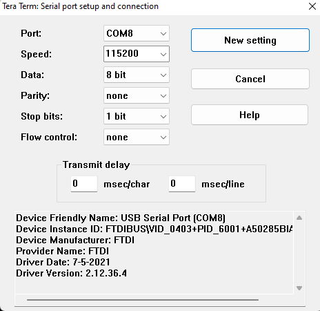
4. Ahora para no quedarnos ciegos vamos a la configuración de fuente y aumentamos el tamaño y lo dejamos en 14.
   


5. Tras esto enchufamos el router a la corriente y veremos el bootloader cargando.

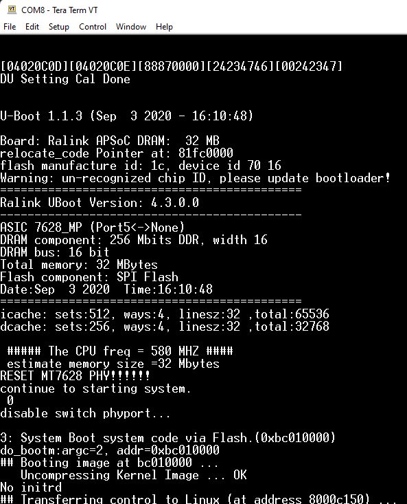

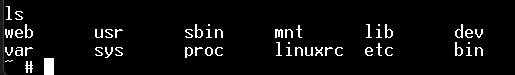

Tras esto ya podemos escribir comandos pero antes vamos a ver como se haría con el bus pirate.

### Usando Bus Pirate

Ahora explicaremos paso a paso con el bus pirate:

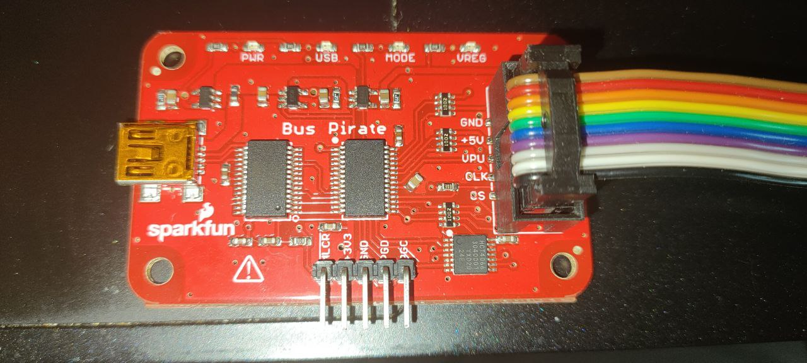

La configuración del emulador de terminal es la misma que en el USB-to-TTL ahora lo importante es como conectemos los cables, aqui tenemos un esquema de que es cada color:


1.  Ahora debemos conectar el MOSI(GRIS) al RX y el MISO(NEGRO) al TX, el GND(MARRON) al GND del router además de conectar el VPU(VERDE) al 5V(NARANJA) del propio bus pirate
   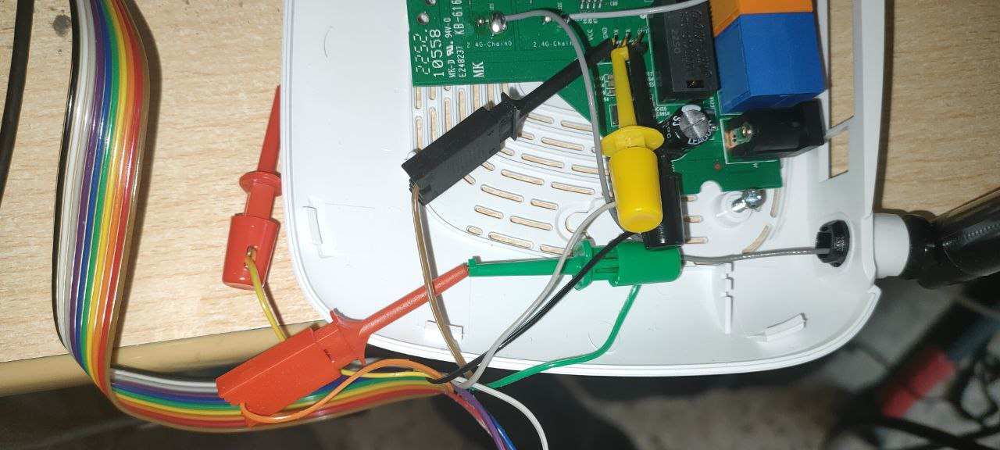
2. Lo siguiente es conectarse usando TeraTerm y con la misma configuración de antes e interactuar con el menu del bus pirate.

Escribimos 'm' y pulsamos intro
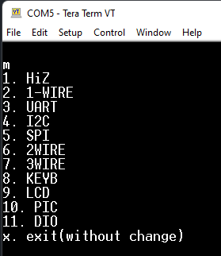
Elegimos el modo 3 (UART)
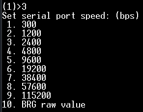
Pulsamos enter 4 veces para elegir todo por defecto es decir: Sin bit de paridad, 1 bit de parada , y con el colector abierto (Open Drain) para meterle por VPU esos 5V que necesita.

Pulsamos 'W' mayúscula para dar corriente, pulsamos 'P' mayúscula para activar las resistencias pull-up y solo nos falta activar el live monitor para recibir la shell de UART. 

Esto lo haremos usando la macro (1) que es el Transparent bridge aunque si ponemos (0) nos saldra la lista de macros.

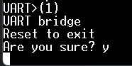
Ahora conectamos el router a la corriente y obtendremos shell.


--- 

## Paso 6: Extraer Sistema de archivos y Firmware

Lo primero que haremos para extraer el sistema de archivos es instalar un servidor [TFTP](https://bitbucket.org/phjounin/tftpd64/downloads/) (Trivial FIle Transfer Protocol), en mi caso instale la version [Tftpd64-4.62-setup.exe](https://bitbucket.org/phjounin/tftpd64/downloads/Tftpd64-4.62-setup.exe) una vez instalada hay que abrirlo y dejar la configuración de esta manera:


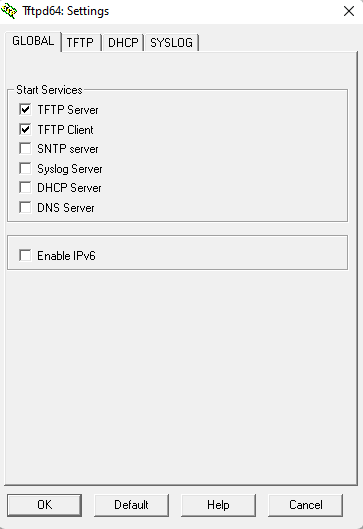


Tras configurarlo nos conectamos al router por wifi o por cable y revisamos que ip nos ha dado:

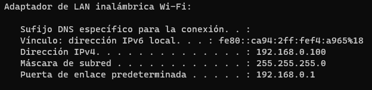

Con esto ya sabemos que desde el terminal del router tenemos transferir por TFTP a 192.168.0.100 

Para comprobar que estamos conectados al router por red introducimos la puerta de enlace en el navegador:


Una vez conectados es el momento de extraer el sistema de archivos y el firmware completo.

Tenemos una terminal muy limitada, para tener mas herramientas  hay que subir una copia de [busybox-mipsel.](https://busybox.net/downloads/binaries/1.21.1/busybox-mipsel)
### Obtención de la flash via MTD

Este router utiliza el subsistema MTD, que se divide en bloques. Concatenamos todos los bloques en orden para obtener el contenido de la flash, para más información de [MTD.](http://linux-mtd.infradead.org/doc/general.html) 

Los bloques se encuentran en el directorio /dev y empiezan por la palabra mtd:


Copiamos todos los archivos de mtd con el script [transfer.sh](assets/transfer.sh).

--- 

## Paso 7: Extraccion del Firmware

Metemos los archivos en kali y los concatenamos siguiendo estos comandos:

```bash
cat mtdblock0 > firmware

cat mtdblock1 >> firmware

cat mtdblock2 >> firmware

cat mtdblock3 >> firmware

cat mtdblock4 >> firmware
```

Descomprimimos y extraemos con binwalk para después poder analizarlo:

```bash
binwalk -eM firmware
```

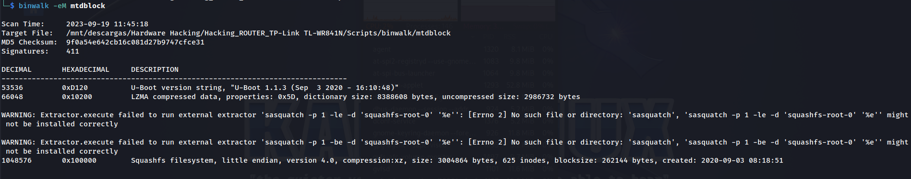
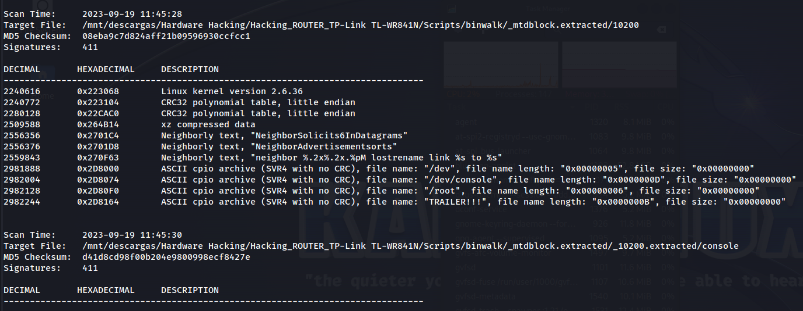
