# Hardware Hacking ES Comunidad

- Discord: https://discord.gg/wkWr6Dj46D 
- Telegram: https://t.me/hardwarehackinges

---

# Encontrar puerto COM para el Bus Pirate

**Importante hacer estos pasos antes de conectar el Bus Pirate**

La manera más rápida y eficaz es abrir el **Administrador de Dispositivos** (device manager) buscándolo en el sistema.

También podemos usar la secuencia **win+r** escribiendo devmgmt.msc 

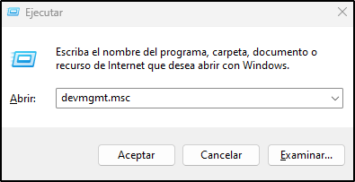

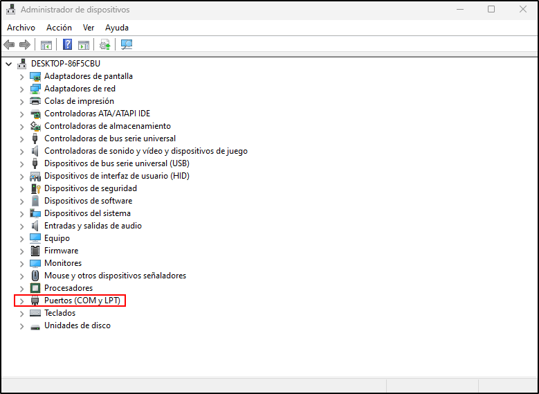

Una vez se nos abra el administrador de dispositivos nos interesa la parte **Puertos (COM y LPT)**. 

Al desplegarlo obtendremos los puertos previos a conectar el Bus Pirate

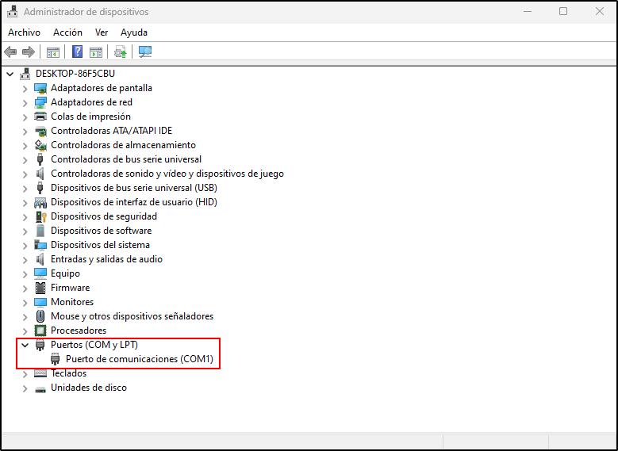

Al conectar el Bus Pirate aparece el nuevo puerto COM que tendremos que utilizar.
En el caso de la imagen USB Serial Port (COM4).

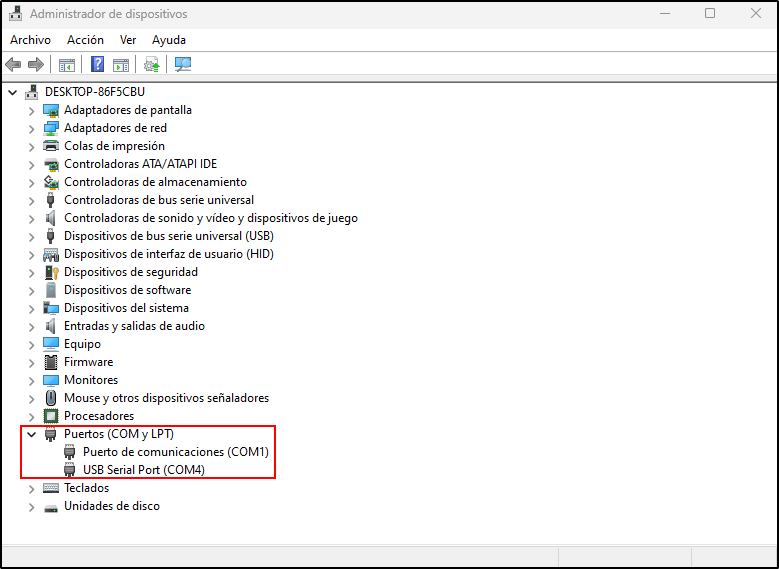

---

# Hacking EEPROM AT24C256 I2C 5V

### Material Requerido:

- [BusPiratev3](https://www.adafruit.com/product/237)
- [EEPROM AT24C256 I2C 5V](https://es.aliexpress.com/item/4000099529430.html?spm=a2g0o.productlist.main.1.2bd56c2cd7dFX0&algo_pvid=a2da1f90-95d1-4099-8463-9e25238687ec)
- [Pinzas BusPirate](https://www.adafruit.com/product/238)

## Paso 1: Conectar pinzas a EEPROM

Usamos este esquema para conectarnos:


schema by David Sánchez 

Tiene que quedar asi:

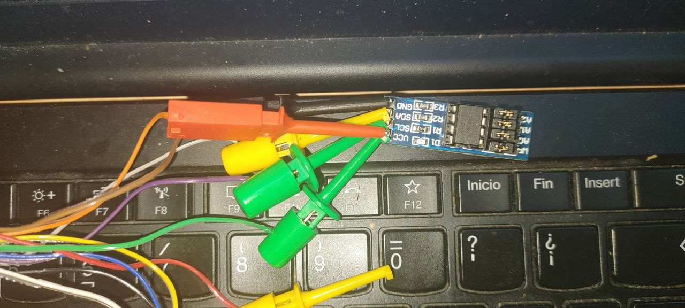

---
## Paso 2: Conectarse al I2C con BusPirate

Ahora nos conectaremos usando algun software como TeraTerm o Putty, en mi caso usare TeraTerm.

1. Lo abrimos y seleccionamos la interfaz COM correspondiente del BusPirate


2. Ahora configuramos la interfaz serial dentro de Setup->Serial Port


3. Y lo dejamos con esta configuracion de 115200 baudios de velocidad, 8 bits de datos, ninguno de paridad y uno de stop. 


4. Ahora para no quedarnos ciegos vamos a la configuración de fuente y aumentamos el tamaño y lo dejamos en 14.


5. Abrimos el menu del buspirate presionando m+enter

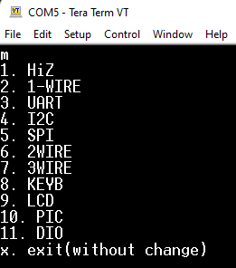

6. Presionamos el 4 y damos enter, dos veces

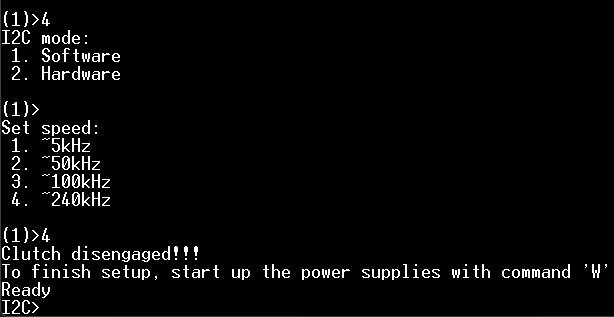

Presionamos W mayúscula y P mayúscula y ya podriamos leer la memoria y escribir

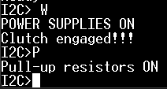

---

## Paso 3:  Localizar direcciones I2C

Usamos la macro de búsqueda de direcciones de 7bit para obtener la dirección de escritura y de lectura.

Escribimos (1) y damos a enter

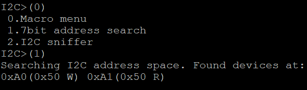

---
## Paso 4:  Como leer y escribir con I2C

#### Como escribir I2C

Con los corchetes indicamos el principio y el final de cada comando I2C.

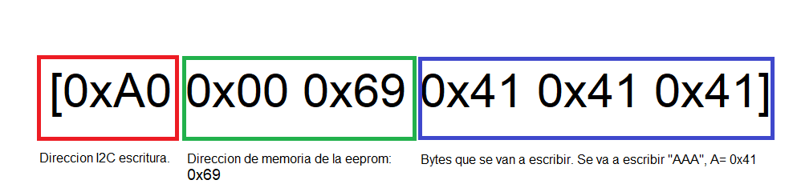

El primer byte en hexadecimal es la dirección que indica si escribimos o leemos.

Los dos siguientes bytes son la direccion donde se va a escribir. 

Los bytes 0x41 0x41 0x41 son el contenido que se escribira en la dirección selecionada de manera consecutiva.

#### Como leer I2C

Para leer una dirección tenemos que usar la direccion de escritura de la eeprom.

Hay que escribir la direccion para luego poder leer el contenido aunque no sobreescribamos nada.

Se sigue el mismo patrón que escribiendo pero sin Bytes de contenido.

```i2c
[0xA0 0x00 0x69]
```

Después de seleccionar la direccion 0x69 escribimos el byte de lectura y una r para leer un byte, en el caso que queramos leer varios bytes escribimos 'r:(numero de veces)' para que sea una lectura secuencial.

```i2c
[0xa1 r:20]
```

---

Tenemos flasheado el CTF de Dreg, para leer la flag de la EEPROM introducimos estos comandos:

```bash
[0xA0 0x00 0x69]

[0xa1 r:20]
```

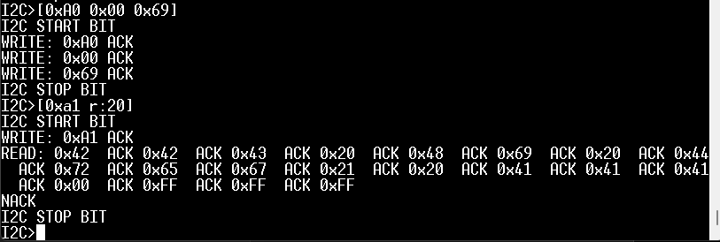

Para saber mas sobre el protocolo I2C con el bus pirate lee [esto.](http://dangerousprototypes.com/blog/bus-pirate-manual/i2c-guide/)

Usamos un conversor de [hexadecimal](https://gchq.github.io/CyberChef/) y obtenemos este resultado.


---

# Hacking FLASH SPI Winbond 25Q64FVSIG

### Material Requerido:

- [BusPiratev3](https://www.adafruit.com/product/237)
- [SPI FLASH 25Q64FVSIG 3,3V](https://es.aliexpress.com/item/4000099529430.html?spm=a2g0o.productlist.main.1.2bd56c2cd7dFX0&algo_pvid=a2da1f90-95d1-4099-8463-9e25238687ec)
- [Pinzas BusPirate](https://www.adafruit.com/product/238)

---
## Paso 1: Conectar pinzas a SPI FLASH

Usamos este esquema para conectarnos:

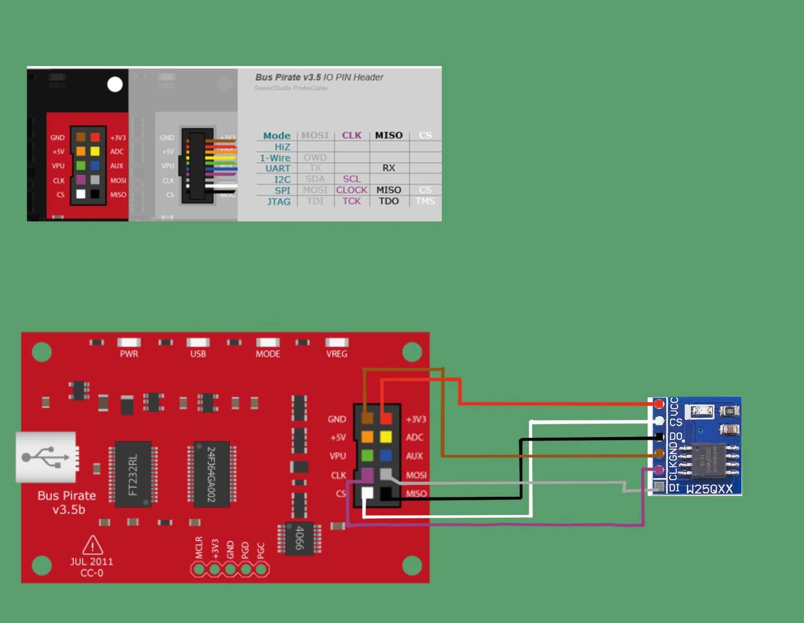

schema by David Sánchez 

Tiene que quedar asi:

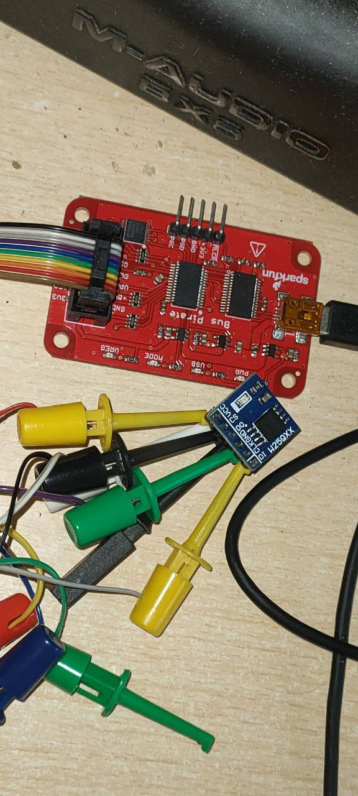

---
## Paso 2: Identificar la SPI Flash

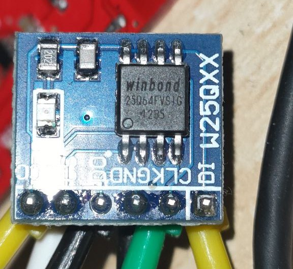

El modelo es [W25Q64FVSIG](https://html.alldatasheet.com/html-pdf/511943/WINBOND/25Q64FVSIG/2115/7/25Q64FVSIG.html) aunque en la herramienta del flashrom indicaremos que es la **W25Q64JV-.Q** y funcionara correctamente.

## Paso 3: Extraer contenido SPI Flash

Descargamos el ultimo release del flashrom desde este [repositorio.](https://github.com/therealdreg/flashrom_build_windows_x64) 

Conectamos el bus pirate y revisamos el numero del puerto COM.

Descomprimimos y abrimos una terminal en el mismo directorio y ejecutamos este comando escribiendo el puerto COM correspondiente.

```cmd
flashrom.exe --progress -V -c "W25Q64JV-.Q" -p buspirate_spi:dev=COM6 -r flash_content.img
```

Si no funciona reconecta el buspirate y ejecuta este comando:

```cmd
flashrom.exe --progress -VV -c "W25Q64JV-.Q" -p buspirate_spi:dev=COM6,spispeed=1M -r flash_contenido.img
```

Obtendremos este archivo:

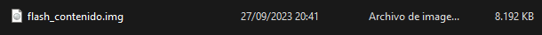

---
## Paso 4: Extracción de la imagen

La abrimos con binwalk y la descomprimimos con este comando.

```bash
binwalk -eM flash_contenido.img
```

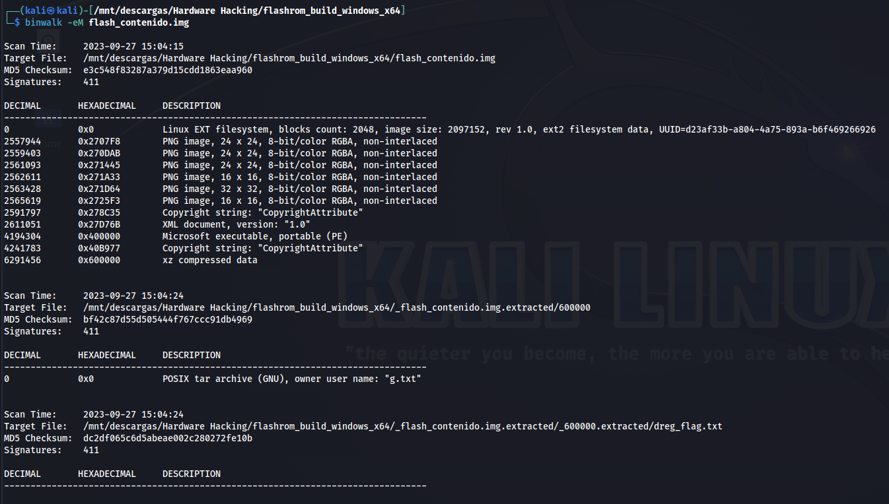

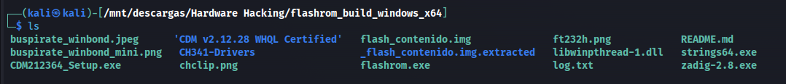

Ahora revisamos lo extraído y buscamos la flag. 

---


# Hacking Router TP-Link TL-WR841N

### Material Requerido:

- TP-Link TL-WR841N 
- Soldador Estaño
- FLux 
- USB a TTL o Buspirate
- Multimetro
- Cable Ethernet o Wifi
- Pines para UART
- Ordenador

## Paso 1: Comprar el router.

El modelo que vamos a analizar es el [TP-Link TL-WR841N V14 ](https://www.amazon.es/dp/B001FWYGJS?ref=ppx_yo2ov_dt_b_product_details&th=1)


---
## Paso 2: Abriendo el router.

Lo primero que debemos hacer es quitar los dos tornillos que hay en la parte inferior y después haremos palanca con algún trozo de plástico, yo he usado una púa de guitarra.


Y ya tendríamos acceso directo a la PCB del router.

---

## Paso 3: Identificar componentes y UART.

Una vez abierto el router hay que identificar todos los componentes posibles.


#### Cada circulo es una parte interesante de la pcb para nosotros:

- Circulo Rojo: Es la memoria RAM. Mirando la [ficha técnica](https://openwrt.org/toh/tp-link/tl-wr841nd) de la Versión 14 en OpenWRT podemos ver que tiene 32 MiB.   


- Circulo Amarillo: Es el SOC (System-On-Chip) MT7628NN.


- Circulo Azul: Es la memoria flash EN25Q32(A/B). Aquí es donde se guarda el bootloader y el sistema de archivos etc.


- Circulo Rosa: Es la Interfaz UART que usaremos para obtener terminal de root y obtener el sistema de archivos. La resistencia **R18** bloquea la escritura UART, luego habrá que quitarla. 
 


---
## Paso 4: Soldar pines a UART y ELIMINAR R18.

Soldar pines a UART no es complicado simplemente necesitaremos:

- [Soldador de estaño](https://www.amazon.es/Profesional-Temperatura-Ajustable-Desoldadora-Antiest%C3%A1ticas/dp/B09B3GRVTM/ref=sr_1_2_sspa?keywords=soldador+esta%C3%B1o&sr=8-2-spons&sp_csd=d2lkZ2V0TmFtZT1zcF9hdGY&psc=1)
- [Estaño](https://www.electronicaembajadores.com/es/Productos/Detalle/HRJ1121/herramienta/accesorios-y-consumibles-de-soldadura/mbo-soldadura-de-estano-60-sn-40-pb-0-5-mm-250-g-121103) a poder ser de calidad (se notan mucho los acabados.)
- [Pines](https://www.amazon.es/ANGEEK-Single-Breakable-Connector-Arduino/dp/B07XXXNH9V/ref=sr_1_5?__mk_es_ES=%C3%85M%C3%85%C5%BD%C3%95%C3%91&keywords=Pines+pcb&sr=8-5)


Aqui vemos como se ha eliminado la **R18** que impide la escritura a través de UART y los pines listos para conectarnos. En este caso hemos conectado el RX, el TX y el GND. El VCC no es necesario porque la alimentación la daremos usando el adaptador de corriente del router.


---

## Paso 5: Conectarse al UART.

### Usando USB-to-TTL


Aqui podemos ver como he conectado todos los pines desde el USB_UART-to-TTL, una cosa IMPORTANTE es que para que funcione la escritura necesitamos que el cable de datos TX vaya a 5V, porque si lo ponemos a 3,3V no funcionara correctamente.

Ahora para conectarnos correctamente lo primero es entender el protocolo [SERIAL](https://learn.sparkfun.com/tutorials/serial-communication) ,lo mas importante es que el pin RX del adaptador TTL-USB tiene que ir al TX del router y el TX del adaptador TTL-USB al RX del router además de conectar los dos GNDs. 


Ahora nos conectaremos usando algun software como TeraTerm o Putty, en mi caso usare TeraTerm.

1. Lo abrimos y seleccionamos la interfaz COM correspondiente del TTL-USB


2. Ahora configuramos la interfaz serial dentro de Setup->Serial Port


3. Y lo dejamos con esta configuracion de 115200 baudios de velocidad, 8 bits de datos, ninguno de paridad y uno de stop. 


4. Ahora para no quedarnos ciegos vamos a la configuración de fuente y aumentamos el tamaño y lo dejamos en 14.


5. Tras esto enchufamos el router a la corriente y veremos el bootloader cargando.


Tras esto ya podemos escribir comandos pero antes vamos a ver como se haría con el bus pirate.

### Usando Bus Pirate

Ahora explicaremos paso a paso con el bus pirate:


La configuración del emulador de terminal es la misma que en el USB-to-TTL ahora lo importante es como conectemos los cables, aqui tenemos un esquema de que es cada color:


1.  Ahora debemos conectar el MOSI(GRIS) al RX y el MISO(NEGRO) al TX, el GND(MARRON) al GND del router además de conectar el VPU(VERDE) al 5V(NARANJA) del propio bus pirate


   
2. Lo siguiente es conectarse usando TeraTerm y con la misma configuración de antes e interactuar con el menu del bus pirate.


Escribimos 'm' y pulsamos intro


Elegimos el modo 3 (UART)


Pulsamos enter 4 veces para elegir todo por defecto es decir: Sin bit de paridad, 1 bit de parada , y con el colector abierto (Open Drain) para meterle por VPU esos 5V que necesita.

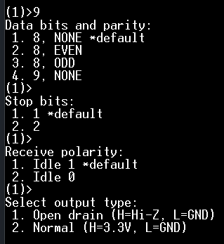

Pulsamos 'W' mayúscula para dar corriente, pulsamos 'P' mayúscula para activar las resistencias pull-up y solo nos falta activar el live monitor para recibir la shell de UART. 


Esto lo haremos usando la macro (1) que es el Transparent bridge aunque si ponemos (0) nos saldra la lista de macros.


Ahora conectamos el router a la corriente y obtendremos shell.


--- 

## Paso 6: Extraer Sistema de archivos y Firmware

Lo primero que haremos para extraer el sistema de archivos es instalar un servidor [TFTP](https://bitbucket.org/phjounin/tftpd64/downloads/) (Trivial FIle Transfer Protocol), en mi caso instale la version [Tftpd64-4.62-setup.exe](https://bitbucket.org/phjounin/tftpd64/downloads/Tftpd64-4.62-setup.exe) una vez instalada hay que abrirlo y dejar la configuración de esta manera:


Tras configurarlo nos conectamos al router por wifi o por cable y revisamos que ip nos ha dado:


Con esto ya sabemos que desde el terminal del router tenemos transferir por TFTP a 192.168.0.100 

Para comprobar que estamos conectados al router por red introducimos la puerta de enlace en el navegador:

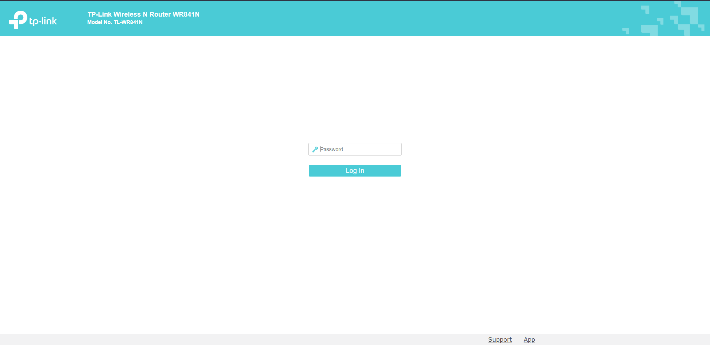

Una vez conectados es el momento de extraer el sistema de archivos y el firmware completo.

Tenemos una terminal muy limitada, para tener mas herramientas  hay que subir una copia de [busybox-mipsel.](https://busybox.net/downloads/binaries/1.21.1/busybox-mipsel)
### Obtención de la flash via MTD

Este router utiliza el subsistema MTD, que se divide en bloques. Concatenamos todos los bloques en orden para obtener el contenido de la flash, para más información de [MTD.](http://linux-mtd.infradead.org/doc/general.html) 

Los bloques se encuentran en el directorio /dev y empiezan por la palabra mtd:

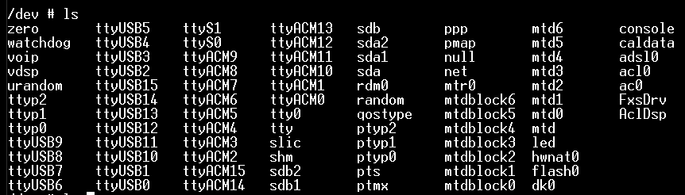

Copiamos todos los archivos de mtd con el script [transfer.sh](assets/transfer.sh).

--- 

## Paso 7: Extraccion del Firmware

Metemos los archivos en kali y los concatenamos siguiendo estos comandos:

```bash
cat mtdblock0 > firmware

cat mtdblock1 >> firmware

cat mtdblock2 >> firmware

cat mtdblock3 >> firmware

cat mtdblock4 >> firmware
```

Descomprimimos y extraemos con binwalk para después poder analizarlo:

```bash
binwalk -eM firmware
```


---

# Buscando UART con Analizador Lógico

### Material Requerido:

- [Analizador Lógico](https://www.amazon.es/AZDelivery-Logic-Analyzer-compatible-versi%C3%B3n/dp/B01MUFRHQ2/ref=sr_1_1_sspa?keywords=analizador%2Blogico%2Busb&sr=8-1-spons&sp_csd=d2lkZ2V0TmFtZT1zcF9hdGY&th=1)
- [Router con UART](https://www.amazon.es/dp/B001FWYGJS?psc=1&ref=ppx_yo2ov_dt_b_product_details) 
- [Saleae Logic Pro](https://www.saleae.com/downloads/)
- [Multimetro](https://www.amazon.es/Multimetro-AoKoZo-Autom%C3%A1tico-Polimetro-Tama%C3%B1o147/dp/B085PVTTST/ref=sxin_18_sbv_search_btf?__mk_es_ES=%C3%85M%C3%85%C5%BD%C3%95%C3%91&content-id=amzn1.sym.bd3d7401-e3ca-409d-87bd-d7a8fe595740%3Aamzn1.sym.bd3d7401-e3ca-409d-87bd-d7a8fe595740&cv_ct_cx=multimetro&keywords=multimetro&pd_rd_i=B085PVTTST&sbo=RZvfv%2F%2FHxDF%2BO5021pAnSA%3D%3D&sr=1-1-9131241a-a358-4619-a7b8-0f5a65d91d81) 

## Paso 1: Encontrar el GND

Si tenemos el UART a la vista puede que tenga escrito cerca **GND**. Otra opción es identificar la flash o otro componente y buscar que pata según el datasheet es el **GND**, después buscaremos continuidad en otros componentes de la placa donde poder engancharnos.

Aqui se ve el modo continuidad del multimetro:

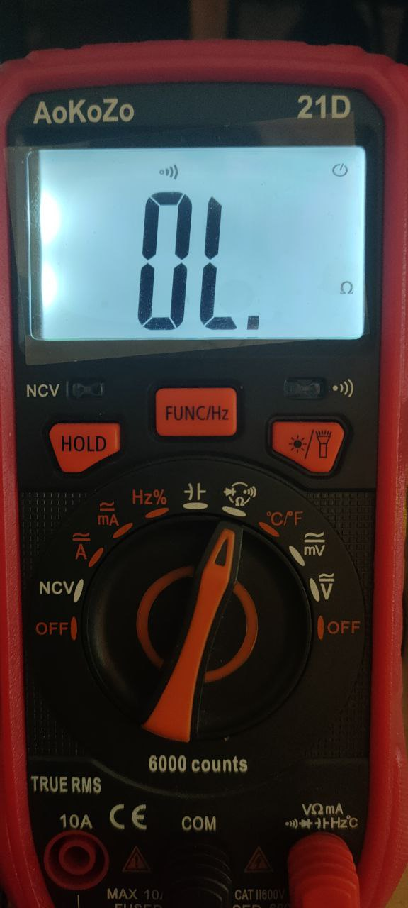

Mirando el [datasheet](https://html.alldatasheet.com/html-pdf/458184/EON/EN25Q32B-104HIP/130/2/EN25Q32B-104HIP.html) vemos cual es el GND.


Ahora que ya sabemos cual de los pines es el GND es momento de conectar el analizador lógico.

--- 

## Paso 2: Conectar Analizador

Conectamos el GND del router al del analizador lógico y los pines que creamos que pueden ser el UART del router a 2 pines del analizador.

Aquí vemos los diferentes canales, yo conectare el GND, 5 y el 7 que en el Logic Pro son el 4 y el 6.

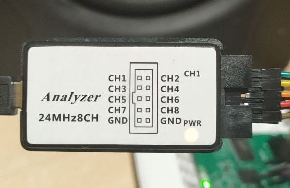

Aquí vemos como conecte el GND.

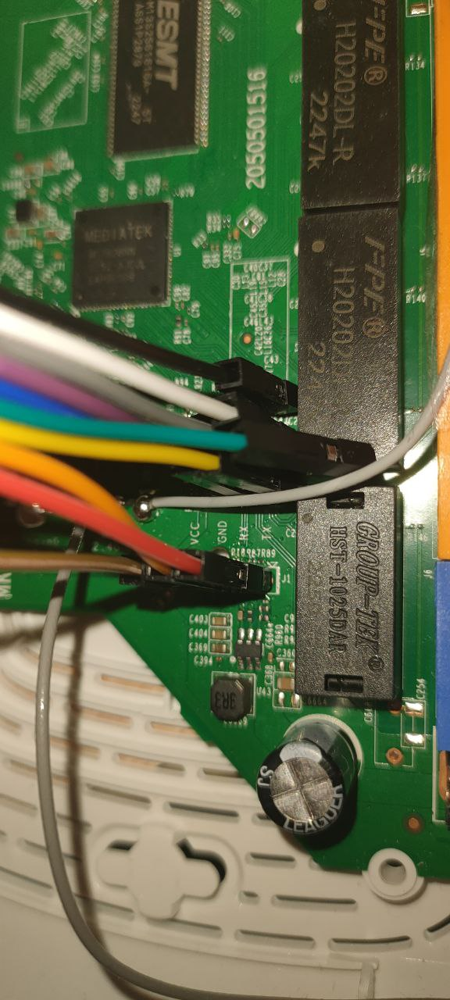

----

## Paso 3: Averiguar el Baud Rate 

Abrimos el Saleae Logic  y le damos al boton de play, despues enchufamos el router y esperamos a recibir señales.

Asi se vera la imagen del Logic tras darle al pause.

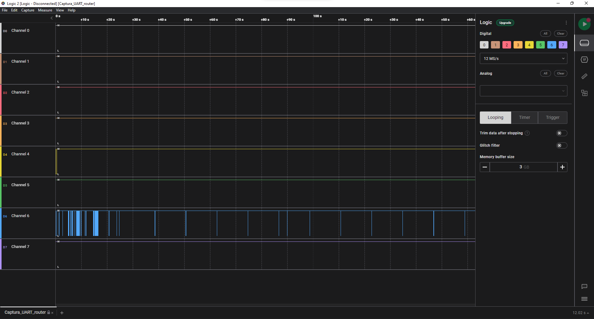

Ahora tenemos que añadir la extension de Baud Rate estimate.

Vamos a la pestaña de extensiones de la derecha, la buscamos  y  le damos click a install.

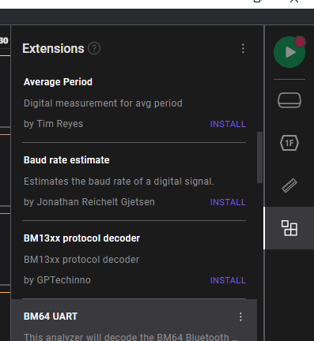

Vamos a la pestaña de marcadores de tiempo medidas y notas.

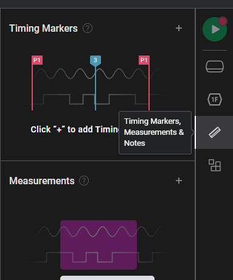

Mantenemos *shift* y selecionamos una parte grande del canal donde hayamos recibido datos.

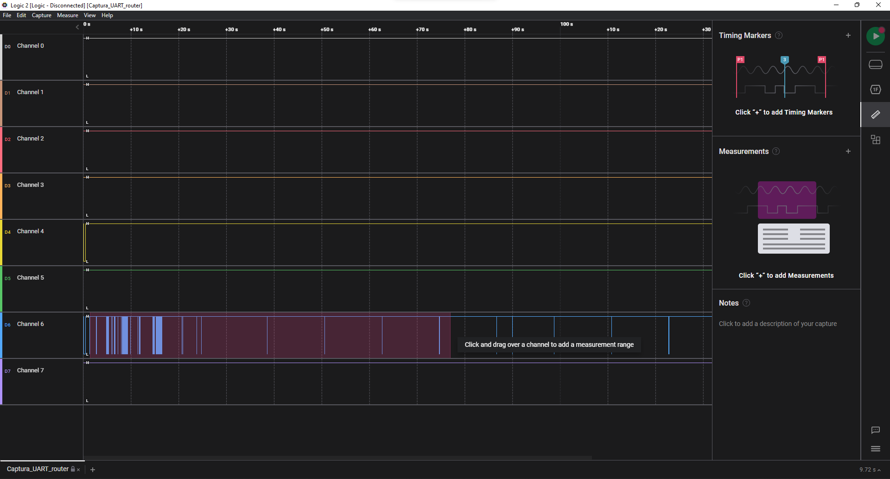

Tras esto nos saldrá un recuadro con un baud rate aproximado de la zona seleccionada.

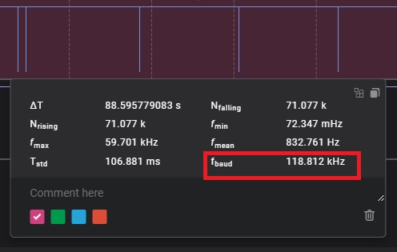

Ahora creamos un analizador dentro de saleae logic tipo serial asíncrono con un baud rate de 115200 baudios que es lo más aproximado a la cifra que nos sale.


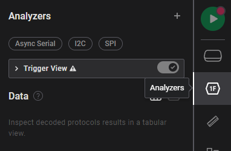


Solo cambiamos los baudios y el canal que hayamos usado, el resto lo dejamos así.

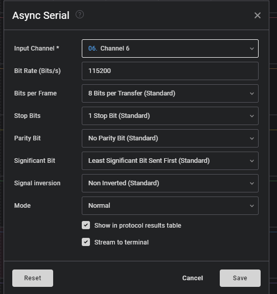


Tras esto seleccionamos la terminal y podremos ver todo el contenido de la señal en texto por pantalla.

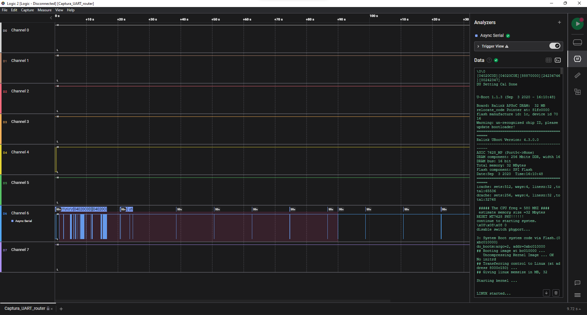


---

# Pull-up y Pull-down para analfabetos.

## Introducción.

Aquí encontrarás explicada, de manera sencilla, la justificación, finalidad, funcionamiento y detalles de las resistencias Pull-up y Pull-down.
## ¡Terror a las antenas!

Te han puesto una tarea. Debes apuntar la posición de una ficha blanca, esta ficha solo puede acabar en dos casillas, en la Posición 1, y en la Posición 0.


Es evidente que la posición de la ficha es 1. Vamos a ver el siguiente caso:


Ahora se encuentra en el 0, pero, ¿cómo ha llegado hasta ahí? La ficha ha tenido que desplazarse, eso seguro. La pregunta es, ¿qué posición le asignamos hasta que llegue a una de las casillas?


Este es uno de los problemas que se encuentras a la hora de transmitir información en la electrónica. Como solo podemos interpretar 2 estados, ¡lo que pase en la transición no lo entenderemos!


En los estados intermedios entre el 1 y el 0 de esta viñeta, la pata que se conecta a uno de los estados está en el aire, actuando como **antena** y captando interferencias indeseadas. A esto se le llama dejar una pata "flotando", algo que debemos evitar en las entradas de información.

Para evitar este problema, y mantener una comunicación estable, se usan las Resistencias Pull-up y Pull-down.

## Conceptos previos: ¿Qué es lo que veo?... 


Bueno... Espero que no te asustes. Lo que ves ahora es el esquema de una **resistencia Pull-up**. Tranquilo, porque vas a entenderlo después de algunos conceptos. Primero vamos a etiquetar cada elemento:


### Elementos del circuito.

Vamos a suponer que el [voltaje o tensión](https://cursos.mcielectronics.cl/2019/06/18/voltaje-corriente-resistencia-y-ley-de-ohm/###Voltaje) es la "velocidad" de la electricidad que recorre el circuito y el [amperaje o intensidad](https://cursos.mcielectronics.cl/2019/06/18/voltaje-corriente-resistencia-y-ley-de-ohm/) de la corriente es el caudal.

1. GND: es una abreviación del término *ground*. Se denomina GND al punto de **referencia** que tomaremos como **"velocidad" 0**, es decir, el **aparcamiento**. Si te fijas, todos los extremos del circuito acaban en el GND, es decir, que antes de llegar a GND tendrán que frenar un poco...
2. VCC (Voltage Common Colector): es la fuente de voltaje que genera la diferencia de tensión más alta respecto al GND. Conceptualmente, **se encarga de dar "velocidad"** a la electricidad.
4. Resistencia: la resistencia **reduce la "velocidad"** de la electricidad. **Cuanta más corriente** pase por el circuito, la **caída de "velocidad" será mayor**. Si esta supuesta velocidad fuese muy alta y "chocase" con GND algo podría salir mal. Se produciría un cortocircuito.
5. Interruptor: seguro que ya lo conoces, alguno debes apretar para poder leer esto... Pero si aún así no te suena lo que hace: **interrumpe o deja pasar** la electricidad.
6. Cables: son las líneas rojas que unen cada elemento y **permite que pase por él el "caudal"** que requiera el circuito.
7. [Sentido de la corriente](http://recursostic.educacion.es/secundaria/edad/3esofisicaquimica/3quincena11/3q11_contenidos_4c.htm): es importante conocer el sentido de la corriente. Usaremos el sentido convencional, que irá del punto negativo al positivo, como muestra la flecha naranja del esquema. 

Para entender los Pull-up/Pull-down no necesitarás realizar cálculos, pero es útil poder interpretar las siguientes expresiones:

1. $Voltaje=Intensidad*Resistencia$ ;     $V= I * R$ 

2. $Potencia=Voltaje*Intensidad$ ;     $P= V * I$

En la primera, nos permite calcular cuánto voltaje es capaz de retener una resistencia según la corriente que pasa por él. Es decir, **la "velocidad" que es capaz de robar al flujo**.

Si conociésemos el voltaje que una resistencia va a restar al circuito podríamos calcular, entonces, la intensidad de corriente que pasa por esta.

La segunda expresión nos permitirá estimar el consumo del circuito, usando el voltaje proporcionado por la fuente y la corriente requerida por los elementos que conectemos.


## Pull-up: ¡Manos a la obra!

No olvidemos que el objetivo de todo esto es enviar información, evitando las confusiones. La información viajará de un origen, que llamamos **Maestro**, a un destinatario, un **Esclavo**.

Por suerte solo tenemos que diferenciar, como hemos dicho, dos mensajes: el **0** y el **1**.

Digamos que nosotros somos el maestro y queremos enviar un 1 al esclavo. Esto podría funcionar:


Si dejamos el interruptor abierto, el 1 solo tiene un camino. Ahora vamos a intentar cerrar el interruptor.


Si no te has saltado los conceptos previos verás que aquí algo ha ido bastante mal. Como el voltaje no ha bajado antes de llegar a GND el cable empieza a actuar como resistencia para disipar la energía en forma de calor. El cable no está preparado para eso y puede alcanzar altas temperaturas. Por si te has perdido, **la velocidad del 1 era muy alta antes de llegar al aparcamiento y se ha estampado contra GND**. Ahora nuestro esclavo podría irse a jugar al parchís, si no se ha roto nada en el proceso.

Quizá te preguntes porqué el 1 no se ha ido directamente hacia nuestro esclavo... Bien, hay algo que no te he explicado, y es que, **para llegar a nuestro esclavo hay un espacio que lo separa**. La información **le cuesta mucho pasar** por ahí, así que **prefiere pasar por el camino más fácil**.

En el entorno real, las entradas de los dispositivos cuentan con una impedancia muy alta (que se opone al paso de la corriente), lo que representaremos en los esquemáticos como resistencias del valor que ronda los MΩ. El objetivo de esta impedancia es **afectar en la menor medida posible al circuito**.

Aclarado todo esto, ahora necesitaremos algo para reducir la velocidad. ¡Seguro que lo estás pensando! Nuestras amigas las resistencias pueden hacernos el trabajo.

## ¡Resistencias! ¡Al rescate!


Ahora, la resistencia ha conseguido frenar por completo el 1, así que como no llega nada, al esclavo se le carga un 0.

Pero, ¿qué pasará si vuelvo a abrir el interruptor? ¿se frenará el 1 sin poder llegar al esclavo? Bueno, eso es una buena pregunta...

Cuando el interruptor no deja pasar la corriente hasta GND, el único elemento que requiere de voltaje es el esclavo. El esclavo, que hemos dicho que estaba un poco separado de la línea de comunicación, produce una impedancia muy alta.

Recuerda ahora la formulita: $V=I*R$. Despejando la $I$ se queda como: $I=V/R$

Si suponemos un voltaje típico de 5V y una resistencia producida por el esclavo de unos 10MΩ, la intensidad de corriente que pasa por **TODO** el cable es 0,0000005 A, ¡Casi nada!

A consecuencia de esta baja corriente, la caída de voltaje o "velocidad", si así lo prefieres, en la resistencia que hemos colocado al principio es muy pequeña. En el ejemplo puesto habría una caída de:  $V=I*R=0,0000005*10kΩ= 0,005 V$

El esclavo recibiría un voltaje de 4.995V, lo que interpretaría como un 1.


¡Ya entiendes como funciona el Pull-up!, pero no cantes victoria, aun queda que te explique el Pull-down.

## Pulldown: vamos a ser breves.

Vamos a coger la misma estructura del Pull-up y intercambiamos las posiciones del interruptor y la resistencia de este modo:


Como podemos ver, cuando el interruptor está abierto, el esclavo solo puede interpretar un 0, mientras que si cerramos el interruptor, conseguiremos pasarle al esclavo el 1.


## Resumen: ¡no des más la chapa!

Los Pull-up y Pull-down sirven para guardar estados por defecto, incluso cuando no se recibe energía de ninguna fuente. Los estados por defecto son aquellos en los que se queda cuando no se recibe energía.

| Tipo      | Estado por defecto | Estado Activo |
|-----------|----------------|---------------|
| Pull-Up   | 1              | 0             |
| Pull-Down | 0              | 1             |


## ¿Dónde encuentro los Pull-Up en el BusPirate?

Para ello, miramos el esquemático del fabricante, en mi caso, la [v3.6a](https://cdn.sparkfun.com/datasheets/Tools/BusPirate-v3.6a.pdf).

Haremos un análisis de ejemplo con el pin de Chip Select (CS).
Lo hacemos funcionar en [OPEN DRAIN](https://www.analog.com/en/design-center/glossary/open-drain-collector.html), donde el chip dejará el pin flotando o conectado a GND:

| Pin | GND | Flotando |
|------|-----|----------|
| CS  | 0   | 1        |


Cuando el pin se deja flotando, el Pull-Up nos permite proporcionar 2.8V al chip, es decir, un 1. Si dejamos el pin conectado a GND el chip interpretará un 0 en la entrada.

## Por si se te antojan algunos detalles...

Te dejo los [esquemáticos](https://www.multisim.com/content/YMY72mDiKxPaKZova2JLzm/pulluppulldown/open) con medidas del circuito.
