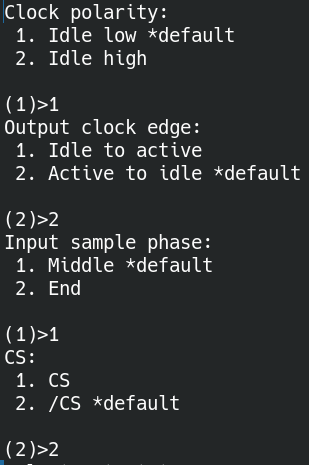
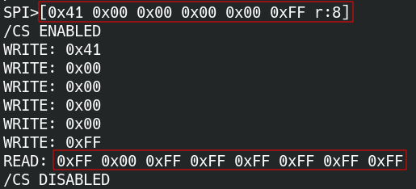
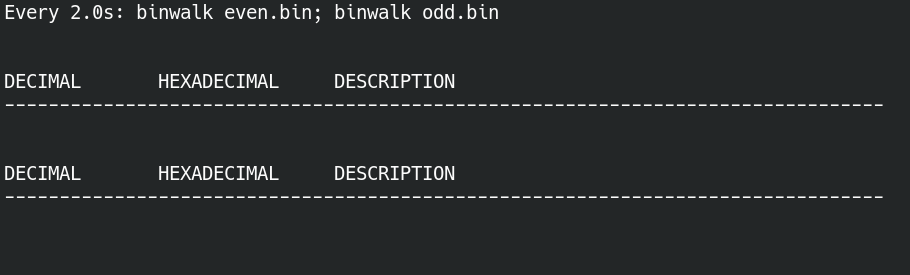

# Hardware Hacking ES Comunidad

- Discord: https://discord.gg/wkWr6Dj46D 
- Telegram: https://t.me/hardwarehackinges


# Índice   
1. [Fundamentos Teóricos](#id1)
    <details><summary>+ info</summary>

    1.1. [¿Qué es esto del Hardware Hacking?](#id1_1)
    1.2. [¿Qué necesito para empezar en esto?](#id1_2)
    1.3. [Tengo un BusPirate v3 pero... ¿Qué es esto?](#id1_3)
    1.4. [Pull-up y Pull-down para analfabetos](#id1_4)
        <details><summary>+ info</summary>
        1.4.1. [Introducción](#id1_4_1)
        1.4.2. [¡Terror a las antenas!](#id1_4_2)
        1.4.3. [Conceptos previos: ¿Qué es lo que veo?](#id1_4_3)
        1.4.4. [Pull-up: ¡Manos a la obra!](#id1_4_4)
        1.4.5. [¡Resistencias, al rescate!](#id1_4_5)
        1.4.6. [Pulldown: vamos a ser breves](#id1_4_6)
        1.4.7. [Resumen: ¡no des más la chapa!](#id1_4_7)
        1.4.8. [¿Dónde encuentro los Pull-Up en el BusPirate?](#id1_4_8)
        1.4.9. [Por si se te antojan algunos detalles...](#id1_4_9)
        </details>
    1.5. [Encontrar puerto COM para el Bus Pirate](#id1_5)
    
    </details>

2. [Hacking EEPROM AT24C256 I2C 5V](#id2)
    <details><summary>+ info</summary>

    2.1. [Conectar pinzas a EEPROM](#id2_1)
    2.2. [Conectarse al I2C con BusPirate](#id2_2)
    2.3. [Localizar direcciones I2C](#id2_3)
    2.4. [Como leer y escribir con I2C](#id2_4)
    2.5. [Dumpeo o backup](#id2_5)
    2.6. [Flasher AT24C256](#id2_6)

    </details>

3. [Hacking FLASH SPI Winbond 25Q64FVSIG](#id3)
    <details><summary>+ info</summary>

    3.1. [Conectar pinzas a SPI FLASH](#id3_1)
    3.2. [Identificar la SPI Flash](#id3_2)
    3.3. [Extraer contenido SPI Flash](#id3_3)
    3.4. [Extracción de la imagen](#id3_4)

    </details>

4. [Hacking Router TP-Link TL-WR841N](#id4)
    <details><summary>+ info</summary>

    4.1. [Comprar el router](#id4_1)
    4.2. [Abriendo el router](#id4_2)
    4.3. [Identificar componentes y UART](#id4_3)
    4.4. [Soldar pines a UART y ELIMINAR R18](#id4_4)
    4.5. [Buscando UART con Analizador Lógico](#id4_5)
    4.6. [Encontrar el GND](#id4_6)
    4.7. [Conectar Analizador](#id4_7)
    4.8. [Averiguar el Baud Rate](#id4_8)
    4.9. [Conectarse al UART](#id4_9)
    4.10. [Extraer Sistema de archivos y Firmware](#id4_10)
    4.11. [Extraccion del Firmware](#id4_11)

    </details>

5. [Hacking SD Transcend TS2GUSD](#id5)
    <details><summary>+ info</summary>
    
    5.1. [Conectar pinzas a lector SD](#id5_1)
    5.2. [Conectarse al Bus Pirate](#id5_2)
    5.3. [Inicializar la tarjeta SD en modo SPI](#id5_3)
    5.4. [Lectura de bloques](#id5_4)

    </details>

6. [Webs, libros, recursos, a quien seguir...](#id6)


# 1. Fundamentos Teóricos<a name="id1"></a>

## 1.1. ¿Qué es esto del Hardware Hacking?<a name="id1_1"></a>

Básicamente, y en fácil, intentar modificar el comportamiento de un cacharro para que haga algo que yo quiera que haga, esté dentro de su diseño inicial o no.

Para conseguir tal objetivo tendremos que acceder hasta su hardware de alguna forma, entender qué tiene y cómo está montado, para luego conseguir extraer su firmware y modificarlo.

La modificación que quiera hacer puede ser tan sencilla como cambiar algo de su firmware hasta implicar una modificación del hardware físico (desoldar y soldar otros componentes) para cambiar sus capacidades.

En este repositorio vamos a intentar cubrir algunos casos prácticos para irnos introduciendo en esto del hardware hacking y sus técnicas, más como ejemplos sencillitos para ir aprendiendo las técnicas que con ningún otro objetivo.

Un disclaimer importante es que no se van a realizar técnicas ilegales o vinculadas con el imaginario popular de lo que se cree que es el hacking: no vamos a hackear el whatsapp de tu novia ni vamos a atacar a ninguna entidad gubernamental. Ésto va más en la línea de entender cacharros para poderles sacar capacidades.
## 1.2. ¿Qué necesito para empezar en esto?<a name="id1_2"></a>

1. **Ganas de estudiar y aprender**: No hay una forma directa y sencilla de adquirir conocimiento sobre esto, normalmente necesitarás estudiar esquemáticos, leer documentación técnica y pasar muchas horas intentando entender qué carajos estás haciendo. Esto es parte de la diversión.

2. **Material de soldadura**: No te tienes que gastar una millonada, pero sí hay una serie de cosas que son básicas y que vas a necesitar. Hay miles de guías y listas de materiales que podrías seguir, pero todo se resume en:
    * Soldador y desoldador
    * Estaño
    * Flux
    * Pines macho y hembra
    * Cables de electrónica (los reconocerás porque son muy finitos y de colorines)
    
    A partir de aquí, todo son extras para hacerte la vida más fácil.

3. **Cacharrada**: Llamaremos cacharrada a todo aquello que nos ayudará a extraer el firmware y a manipularlo. Para conseguir el objetivo de llegar hasta el firmware de casi cualquier cosa nos bastará con:
    * [Analizador Lógico](https://www.amazon.es/AZDelivery-Logic-Analyzer-compatible-versi%C3%B3n/dp/B01MUFRHQ2/ref=sr_1_1_sspa?keywords=analizador%2Blogico%2Busb&sr=8-1-spons&sp_csd=d2lkZ2V0TmFtZT1zcF9hdGY&th=1)
    * [BusPiratev3](https://www.adafruit.com/product/237)
    * [Pinzas BusPirate](https://www.adafruit.com/product/238)
## 1.3. Tengo un BusPirate v3 pero... ¿Qué es esto?<a name="id1_3"></a>

Nos centramos en el BusPirate v3 en concreto, a pesar de que hay actualizaciones posteriores, por varios motivos:
    1. Es económico. Hoy en día (finales del 2023) no cuesta más allá de 40€ el propio cacharro y sus pinzas.
    2. Lleva mucho tiempo en el mercado, hay mucha gente usándolo, con lo que está mantenido y hay mucha documentación al respecto (incluída esta que estás leyendo). A más comunidad alrededor de un cacharrete, más mantenible será en el futuro, y más pequeña es su curva de entrada.
    3. Tiene muchísimas funcionalidades. Esto es consecuencia directa del punto 2, porque se ha ido evolucionando a medida que más gente ha ido usándolo y ampliando su uso.

Para saber exactamente qué tenemos entre manos, puedes acceder a su documentación [aquí](http://dangerousprototypes.com/docs/Bus_Pirate/es), o puedes seguir leyendo. Haremos un resumen de sus funcionalidades centrado en los casos de uso que vamos a ver.

**ADVERTENCIA**: Las máquinas virtuales (VM) y/o USB HUBs pueden causar problemas. Es recomendable utilizar SIEMPRE un sistema operativo nativo y conectar el Bus Pirate directamente a un puerto USB.

**ADVERTENCIA**: Recomiendo utilizar como máximo una velocidad de 100kHz aproximadamente para cada protocolo, ya que la calidad de los cables es importante y no me fío de que la longitud del tuyo sea corta, sobre todo si hay un adaptador a clips, etc. Cuanto más largo sea el cable y más adaptadores haya, junto con un voltaje más bajo, necesitarás usar una velocidad más baja. Así que configura el flashrom o cualquier otro software que utilices para usar la velocidad que sea más conveniente.

Recuerda que como lector puedes contribuir a seguir mejorando esta documentación haciendo un Pull Request a la documentación añadiendo todo lo que te gustaría leer.

El esquema genérico de colores para los cables es el siguiente:


La explicación de cada uno de los pines (y cables, con sus respectivos colores es):
| **Nombre del pin** | **Color del cable** | **Descripción genérica**                                         | **SPI**            | **JTAG**           | **1-Wire**     | **I2C**        | **KB**         | **UART** |
|--------------------|---------------------|------------------------------------------------------------------|--------------------|--------------------|----------------|----------------|----------------|----------|
| MOSI               | Gris                | Master de datos de salida                                        | Esclavo de entrada | Esclavo de entrada | Datos de serie | Datos de serie | Datos de serie | TX       |
| CLK                | Morado              | Señal de reloj                                                   | Señal de reloj     | Señal de reloj     |                | Señal de reloj | Señal de reloj |          |
| MISO               | Negro               | Master de datos de entrada                                       | Esclavo de salida  | Esclavo de salida  |                |                |                | RX       |
| CS                 | Blanco              |                                                                  | Selector de chip   | TMS                |                |                |                |          |
| AUX                | Azul                | Auxiliar IO, medidor de frecuencia, modulador del ancho de pulso |                    |                    |                |                |                |          |
| ADC                | Amarillo            | Medidor de voltaje (máximo 6V)                                   |                    |                    |                |                |                |          |
| VPU                | Verde               | Entrada de voltaje para las resistencias pull-up (0-5V)          |                    |                    |                |                |                |          |
| +3.3v              | Rojo                | Fuente de 3.3V                                                   |                    |                    |                |                |                |          |
| +5.0v              | Naranja             | Fuente de 5V                                                     |                    |                    |                |                |                |          |
| GND                | Marrón              | Tierra, conectar a la tierra del circuito test                   |                    |                    |                |                |                |          |
## 1.4. Pull-up y Pull-down para analfabetos<a name="id1_4"></a>
### 1.4.1. Introducción<a name="id1_4_1"></a>

Aquí encontrarás explicada, de manera sencilla, la justificación, finalidad, funcionamiento y detalles de las resistencias Pull-up y Pull-down.
### 1.4.2. ¡Terror a las antenas!<a name="id1_4_2"></a>

Te han puesto una tarea. Debes apuntar la posición de una ficha blanca, esta ficha solo puede acabar en dos casillas, en la Posición 1, y en la Posición 0.


Es evidente que la posición de la ficha es 1. Vamos a ver el siguiente caso:


Ahora se encuentra en el 0, pero, ¿cómo ha llegado hasta ahí? La ficha ha tenido que desplazarse, eso seguro. La pregunta es, ¿qué posición le asignamos hasta que llegue a una de las casillas?


Este es uno de los problemas que se encuentras a la hora de transmitir información en la electrónica. Como solo podemos interpretar 2 estados, ¡lo que pase en la transición no lo entenderemos!


En los estados intermedios entre el 1 y el 0 de esta viñeta, la pata que se conecta a uno de los estados está en el aire, actuando como **antena** y captando interferencias indeseadas. A esto se le llama dejar una pata "flotando", algo que debemos evitar en las entradas de información.

Para evitar este problema, y mantener una comunicación estable, se usan las Resistencias Pull-up y Pull-down.
### 1.4.3. Conceptos previos: ¿Qué es lo que veo?<a name="id1_4_3"></a>


Bueno... Espero que no te asustes. Lo que ves ahora es el esquema de una **resistencia Pull-up**. Tranquilo, porque vas a entenderlo después de algunos conceptos. Primero vamos a etiquetar cada elemento:


#### Elementos del circuito.

Vamos a suponer que el [voltaje o tensión](https://cursos.mcielectronics.cl/2019/06/18/voltaje-corriente-resistencia-y-ley-de-ohm/###Voltaje) es la "velocidad" de la electricidad que recorre el circuito y el [amperaje o intensidad](https://cursos.mcielectronics.cl/2019/06/18/voltaje-corriente-resistencia-y-ley-de-ohm/) de la corriente es el caudal.

1. GND: es una abreviación del término *ground*. Se denomina GND al punto de **referencia** que tomaremos como **"velocidad" 0**, es decir, el **aparcamiento**. Si te fijas, todos los extremos del circuito acaban en el GND, es decir, que antes de llegar a GND tendrán que frenar un poco...
2. VCC (Voltage Common Colector): es la fuente de voltaje que genera la diferencia de tensión más alta respecto al GND. Conceptualmente, **se encarga de dar "velocidad"** a la electricidad.
4. Resistencia: la resistencia **reduce la "velocidad"** de la electricidad. **Cuanta más corriente** pase por el circuito, la **caída de "velocidad" será mayor**. Si esta supuesta velocidad fuese muy alta y "chocase" con GND algo podría salir mal. Se produciría un cortocircuito.
5. Interruptor: seguro que ya lo conoces, alguno debes apretar para poder leer esto... Pero si aún así no te suena lo que hace: **interrumpe o deja pasar** la electricidad.
6. Cables: son las líneas rojas que unen cada elemento y **permite que pase por él el "caudal"** que requiera el circuito.
7. [Sentido de la corriente](http://recursostic.educacion.es/secundaria/edad/3esofisicaquimica/3quincena11/3q11_contenidos_4c.htm): es importante conocer el sentido de la corriente. Usaremos el sentido convencional, que irá del punto negativo al positivo, como muestra la flecha naranja del esquema. 

Para entender los Pull-up/Pull-down no necesitarás realizar cálculos, pero es útil poder interpretar las siguientes expresiones:

1. $Voltaje=Intensidad*Resistencia$ ;     $V= I * R$ 

2. $Potencia=Voltaje*Intensidad$ ;     $P= V * I$

En la primera, nos permite calcular cuánto voltaje es capaz de retener una resistencia según la corriente que pasa por él. Es decir, **la "velocidad" que es capaz de robar al flujo**.

Si conociésemos el voltaje que una resistencia va a restar al circuito podríamos calcular, entonces, la intensidad de corriente que pasa por esta.

La segunda expresión nos permitirá estimar el consumo del circuito, usando el voltaje proporcionado por la fuente y la corriente requerida por los elementos que conectemos.
### 1.4.4. Pull-up: ¡Manos a la obra!<a name="id1_4_4"></a>

No olvidemos que el objetivo de todo esto es enviar información, evitando las confusiones. La información viajará de un origen, que llamamos **Maestro**, a un destinatario, un **Esclavo**.

Por suerte solo tenemos que diferenciar, como hemos dicho, dos mensajes: el **0** y el **1**.

Digamos que nosotros somos el maestro y queremos enviar un 1 al esclavo. Esto podría funcionar:


Si dejamos el interruptor abierto, el 1 solo tiene un camino. Ahora vamos a intentar cerrar el interruptor.


Si no te has saltado los conceptos previos verás que aquí algo ha ido bastante mal. Como el voltaje no ha bajado antes de llegar a GND el cable empieza a actuar como resistencia para disipar la energía en forma de calor. El cable no está preparado para eso y puede alcanzar altas temperaturas. Por si te has perdido, **la velocidad del 1 era muy alta antes de llegar al aparcamiento y se ha estampado contra GND**. Ahora nuestro esclavo podría irse a jugar al parchís, si no se ha roto nada en el proceso.

Quizá te preguntes porqué el 1 no se ha ido directamente hacia nuestro esclavo... Bien, hay algo que no te he explicado, y es que, **para llegar a nuestro esclavo hay un espacio que lo separa**. La información **le cuesta mucho pasar** por ahí, así que **prefiere pasar por el camino más fácil**.

En el entorno real, las entradas de los dispositivos cuentan con una impedancia muy alta (que se opone al paso de la corriente), lo que representaremos en los esquemáticos como resistencias del valor que ronda los MΩ. El objetivo de esta impedancia es **afectar en la menor medida posible al circuito**.

Aclarado todo esto, ahora necesitaremos algo para reducir la velocidad. ¡Seguro que lo estás pensando! Nuestras amigas las resistencias pueden hacernos el trabajo.
### 1.4.5. ¡Resistencias, al rescate!<a name="id1_4_5"></a>


Ahora, la resistencia ha conseguido frenar por completo el 1, así que como no llega nada, al esclavo se le carga un 0.

Pero, ¿qué pasará si vuelvo a abrir el interruptor? ¿se frenará el 1 sin poder llegar al esclavo? Bueno, eso es una buena pregunta...

Cuando el interruptor no deja pasar la corriente hasta GND, el único elemento que requiere de voltaje es el esclavo. El esclavo, que hemos dicho que estaba un poco separado de la línea de comunicación, produce una impedancia muy alta.

Recuerda ahora la formulita: $V=I*R$. Despejando la $I$ se queda como: $I=V/R$

Si suponemos un voltaje típico de 5V y una resistencia producida por el esclavo de unos 10MΩ, la intensidad de corriente que pasa por **TODO** el cable es 0,0000005 A, ¡Casi nada!

A consecuencia de esta baja corriente, la caída de voltaje o "velocidad", si así lo prefieres, en la resistencia que hemos colocado al principio es muy pequeña. En el ejemplo puesto habría una caída de:  $V=I*R=0,0000005*10kΩ= 0,005 V$

El esclavo recibiría un voltaje de 4.995V, lo que interpretaría como un 1.


¡Ya entiendes como funciona el Pull-up!, pero no cantes victoria, aun queda que te explique el Pull-down.
### 1.4.6. Pulldown: vamos a ser breves<a name="id1_4_6"></a>
Vamos a coger la misma estructura del Pull-up y intercambiamos las posiciones del interruptor y la resistencia de este modo:


Como podemos ver, cuando el interruptor está abierto, el esclavo solo puede interpretar un 0, mientras que si cerramos el interruptor, conseguiremos pasarle al esclavo el 1.

### 1.4.7. Resumen: ¡no des más la chapa!<a name="id1_4_7"></a>
Los Pull-up y Pull-down sirven para guardar estados por defecto, incluso cuando no se recibe energía de ninguna fuente. Los estados por defecto son aquellos en los que se queda cuando no se recibe energía.
| Tipo      | Estado por defecto | Estado Activo |
|-----------|--------------------|---------------|
| Pull-Up   | 1                  | 0             |
| Pull-Down | 0                  | 1             |
### 1.4.8. ¿Dónde encuentro los Pull-Up en el BusPirate?<a name="id1_4_8"></a>

Para ello, miramos el esquemático del fabricante, en mi caso, la [v3.6a](https://cdn.sparkfun.com/datasheets/Tools/BusPirate-v3.6a.pdf).

Mirando el esquemático del BusPirate, vemos que en la parte dedicada a los Pull-Up hay un circuito adicional. Este nos permite habilitar o desabilitar el uso de los Pull-Up.
Veamos como funciona cada una de las partes:


<span style="color:#e55e22">1.  Esta parte del circuito representada con el cable naranja permite controlar a través de la linea de comandos, con el comando "P", activar los Pull-Up del circuito del color azul. En el caso de la imagen de arriba, el interruptor integrado dentro del chip del BusPirate, que usaremos de forma conceptual, está cerrado y conectado a GND, lo que garantiza un voltaje nulo y, por tanto, el interruptor entre los puntos A y B quedará abierto. Eso significa que no puede llegar de ningún modo voltaje desde VEXTERN. En caso de que el interruptor interno del BusPirate se dejase flotando, llegarían 5V al punto C, lo que cerraría el circuito azul, permitiendo el paso de la corriente que proviene de VEXTERN.</span>

<span style="color:#0068be">2. Conectada a una fuente externa, en este caso, de 5V, el circuito de color azul es el que nos permitirá dar una señal alta (dar un 1) o, conectando el extremo final a GND, una señal baja (dar un 0).</span>

Ahora veamos como sería el circuito y sus conexiones con el Chip Target y el Chip del Bus Pirate cuando el interruptor de la linea naranja está abierto:


<span style="color:#efc72e">3. El cable amarillo representa a los canales de la PCB del BusPirate que conectan el Pull-Up con el pin de Chip Select (CS). En este caso, el Chip ha conectado el pin directamente a GND, lo que da un voltaje nulo (0V) en toda la linea.</span>


<span style="color:#6da707">4. El cable verde es la pinza que colocaremos en la pata CS del BusPirate hasta el pin CS del Chip Objetivo. En la imagen de arriba, el pin está conectado a la linea amarilla, por la que no pasa corriente. Como consecuencia, recibe un 0.</span>


<span style="color:#efc72e">3. Ahora el BusPirate ha abierto el interruptor y la linea amarilla ya no está conectada a GND. De este modo los 5V de VEXTERN llegan desde el cable azul hasta el final.</span>

<span style="color:#6da707">4. Como ahora el cable amarillo tiene 5V, y el verde sigue conectado al amarillo, los 5V llegan hasta el Chip Objetivo, lo que interpretará como un 1.</span>


**Resumiendo**, si el interruptor del cable amarillo está **cerrado** (conectado a GND): Chip Target **recibe un 0**.

Si el interruptor se queda **flotando** (no se conecta a GND ni a ningún otro Voltaje): Chip Target **recibe un 1**.

A este modo de funcionamiento del PIN se le denomina [OPEN DRAIN](https://www.analog.com/en/design-center/glossary/open-drain-collector.html).

`Dato: Los protocolos I2C necesitan siempre los Pull-Up para funcionar, ya que siempre reciben 0 de GND y el 1 con el PIN flotando.`

### 1.4.9. Por si se te antojan algunos detalles...<a name="id1_4_9"></a>

Te dejo los [esquemáticos](https://www.multisim.com/content/YMY72mDiKxPaKZova2JLzm/pulluppulldown/open) con medidas del circuito.


## 1.5. Encontrar puerto COM para el Bus Pirate<a name="id1_5"></a>

**Importante hacer estos pasos antes de conectar el Bus Pirate**

La manera más rápida y eficaz es abrir el **Administrador de Dispositivos** (device manager) buscándolo en el sistema.

También podemos usar la secuencia **win+r** escribiendo devmgmt.msc 


Una vez se nos abra el administrador de dispositivos nos interesa la parte **Puertos (COM y LPT)**. 

Al desplegarlo obtendremos los puertos previos a conectar el Bus Pirate


Al conectar el Bus Pirate aparece el nuevo puerto COM que tendremos que utilizar.
En el caso de la imagen USB Serial Port (COM4).


# 2. Hacking EEPROM AT24C256 I2C 5V<a name="id2"></a>

**Material Requerido**

- [BusPiratev3](https://www.adafruit.com/product/237)
- [EEPROM AT24C256 I2C 5V](https://es.aliexpress.com/item/4000099529430.html?spm=a2g0o.productlist.main.1.2bd56c2cd7dFX0&algo_pvid=a2da1f90-95d1-4099-8463-9e25238687ec)
- [Pinzas BusPirate](https://www.adafruit.com/product/238)

## 2.1. Conectar pinzas a EEPROM<a name="id2_1"></a>

Usamos este esquema para conectarnos:


schema by David Sánchez 

Tiene que quedar asi:


## 2.2. Conectarse al I2C con BusPirate<a name="id2_2"></a>

Ahora nos conectaremos usando algun software como TeraTerm o Putty, en mi caso usare TeraTerm.

1. Lo abrimos y seleccionamos la interfaz COM correspondiente del BusPirate


2. Ahora configuramos la interfaz serial dentro de Setup->Serial Port


3. Y lo dejamos con esta configuracion de 115200 baudios de velocidad, 8 bits de datos, ninguno de paridad y uno de stop. 


4. Ahora para no quedarnos ciegos vamos a la configuración de fuente y aumentamos el tamaño y lo dejamos en 14.


5. Abrimos el menu del buspirate presionando m+enter


6. Presionamos el 4 y damos enter, dos veces


Presionamos W mayúscula y P mayúscula y ya podriamos leer la memoria y escribir


## 2.3. Localizar direcciones I2C<a name="id2_3"></a>

Usamos la macro de búsqueda de direcciones de 7bit para obtener la dirección de escritura y de lectura.

Escribimos (1) y damos a enter


## 2.4. Como leer y escribir con I2C<a name="id2_4"></a>

#### Como escribir I2C

Con los corchetes indicamos el principio y el final de cada comando I2C.


El primer byte en hexadecimal es la dirección que indica si escribimos o leemos.

Los dos siguientes bytes son la direccion donde se va a escribir. 

Los bytes 0x41 0x41 0x41 son el contenido que se escribira en la dirección selecionada de manera consecutiva.

#### Como leer I2C

Para leer una dirección tenemos que usar la direccion de escritura de la eeprom.

Hay que escribir la direccion para luego poder leer el contenido aunque no sobreescribamos nada.

Se sigue el mismo patrón que escribiendo pero sin Bytes de contenido.

```i2c
[0xA0 0x00 0x69]
```

Después de seleccionar la direccion 0x69 escribimos el byte de lectura y una r para leer un byte, en el caso que queramos leer varios bytes escribimos 'r:(numero de veces)' para que sea una lectura secuencial.

```i2c
[0xa1 r:20]
```

Tenemos flasheado el CTF de Dreg, para leer la flag de la EEPROM introducimos estos comandos:

```bash
[0xA0 0x00 0x69]

[0xa1 r:20]
```


Para saber mas sobre el protocolo I2C con el bus pirate lee [esto.](http://dangerousprototypes.com/blog/bus-pirate-manual/i2c-guide/)

Usamos un conversor de [hexadecimal](https://gchq.github.io/CyberChef/) y obtenemos este resultado.


## 2.5. Dumpeo o backup<a name="id2_5"></a>

Tras comprender como se lee la memoria EEPROM, se puede automatizar todo el proceso montando un script que permita disponer de una copia coa través de una imagen o backup con los datos que contiene la misma.

Lo primero que se debe tener en cuenta a la hora de leer la información es la capacidad total que tiene, en este caso:
-
Un kilobyte son 1024 bytes, por lo que al ser 32 kilobytes se tendrán que extraer 32768 bytes totales.

Una forma sencilla es guardar todo el output y luego "parsear" lo que nos interesa en bruto a un fichero de tipo imagen.
Abriendo dicha imagen con un editor hexadecimal se puede ver el contenido en bruto:


A continuación, adjunto el script que use:
```python
import time
import serial
import os

# Configura el puerto COM y la velocidad de comunicación según tu configuración
COM_PORT = 'COM3'
BAUD_RATE = 115200  # Esta velocidad puede variar según tu configuración

# Dirección del dispositivo AT24C256 para lectura
EEPROM_READ_ADDRESS = 0xA1

# Número total de bloques a leer
NUM_BLOCKS = 32  # 32 bytes x 1024 = 32768

# Nombre del archivo para guardar el dump con todo el output
DUMP_FILE = 'eeprom_dump.log'

def configure_bus_pirate(ser):
    # Configura el Bus Pirate para el modo I2C y la velocidad deseada (~100kHz)
    ser.write(b'm\n')  # Selecciona el modo I2C
    time.sleep(0.1)
    ser.write(b'4\n')  # Modo I2C
    time.sleep(0.1)
    ser.write(b'1\n')  # Selección de modo software
    time.sleep(0.1)
    ser.write(b'2\n')  # Establecer velocidad ~50kHz
    time.sleep(0.1)
    ser.write(b'W\n')  # Encender las fuentes de alimentación
    time.sleep(0.1)
    ser.write(b'[0xA0 0x00 0x00]\n')  # Direccion de inicio para leer


def read_eeprom_dump():
    try:
        # Abre la conexión con el puerto COM
        ser = serial.Serial(port=COM_PORT, baudrate=BAUD_RATE, timeout=1)

        # Espera a que se inicialice la comunicación
        time.sleep(2)

        # Configura el Bus Pirate para I2C
        configure_bus_pirate(ser)

        # Realiza la lectura de la EEPROM y guarda los datos en el archivo
        with open(DUMP_FILE, 'wb') as dump_file:
            # Realiza la lectura de los datos en bloques de 64 bytes

            data = ser.read(1200)
            dump_file.write(data)
            for _ in range(NUM_BLOCKS):
                ser.write(b'[0xA1 r:1024]\n')  # Envía el comando para leer 64 bytes
                time.sleep(0.1)
                data = ser.read(12800)
                dump_file.write(data)
                

        print('Dump guardado en:', DUMP_FILE)
    except Exception as e:
        print('Error:', str(e))
    finally:
        # Cierra la conexión
        ser.close()


def parse_log_and_extract_ascii(filename, output_filename):
    ascii_values = []
    with open(filename, 'r') as file:
        lines = file.readlines()
        read_block = False  # Flag para indicar que estamos dentro de un bloque de lectura
        for line in lines:
            if "READ:" in line:
                # Si encontramos un bloque de lectura, marcamos el flag y lo procesamos
                read_block = True
                hex_values = line.split(" ")[1:]  # Extraer los valores hexadecimales

                # Filtrar los valores hexadecimales válidos y convertir a ASCII
                ascii_values.append(''.join([chr(int(value, 16)) for value in hex_values if is_hex(value)]))

    # Filtramos las líneas no deseadas y escribimos los valores ASCII en el archivo de salida
    formatted_values = ''.join(ascii_values)  # Unimos los valores sin saltos de línea
    with open(output_filename, 'w') as output_file:
        output_file.write(formatted_values)

    print('Valores ASCII guardados en:', output_filename)

# Función para verificar si una cadena es un valor hexadecimal
def is_hex(value):
    try:
        int(value, 16)
        return True
    except ValueError:
        return False


if __name__ == "__main__":
    read_eeprom_dump()
    parse_log_and_extract_ascii(DUMP_FILE, 'ascii_values.img')

```
## 2.6. Flasher AT24C256<a name="id2_6"></a>

Una vez se tiene una imagen que cuadra perfectamente con la capacidad de la memoria EEPROM (en este caso 32 KB), se puede automatizar el proceso de flasheo o escritura lo cual nos quitará dolores de cabeza si tenemos que flashear 500 :)

Conociendo el procedimiento de escritura, se pueden escribir todos los bytes iterándolos en bloques. En este caso seleccioné 21 bytes por bloque para no tener problemas con bloques mas grandes, y realicé 1560 iteraciones:


A continuación, adjunto el script que use:
```python
import time
import serial
import os

# Configura el puerto COM y la velocidad de comunicación según tu configuración
COM_PORT = 'COM3'
BAUD_RATE = 115200  # Esta velocidad puede variar según tu configuración

# Dirección del dispositivo AT24C256 para escritura
EEPROM_WRITE_ADDRESS = 0xA0

# Número total de bloques a escribir (calculo realizado en base a bloques de 21 bytes)
NUM_BLOCKS = 1560 # 32 bytes x 1024 = 32768

# Nombre del archivo de imagen
IMG_FILE = 'eeprom.img'

def configure_bus_pirate(ser):
    # Configura el Bus Pirate para el modo I2C y la velocidad deseada (~100kHz)
    ser.write(b'm\n')  # Selecciona el modo I2C
    time.sleep(0.1)
    ser.write(b'4\n')  # Modo I2C
    time.sleep(0.1)
    ser.write(b'1\n')  # Selección de modo software
    time.sleep(0.1)
    ser.write(b'2\n')  # Establecer velocidad ~50kHz
    time.sleep(0.1)
    ser.write(b'W\n')  # Encender las fuentes de alimentación
    time.sleep(0.1)

def generate_write_commands(img_filename):
    commands = []
    with open(img_filename, 'rb') as img_file:
        img_data = img_file.read()

    # Divide los datos de la imagen en bloques de 21 bytes
    blocks = [img_data[i:i + 21] for i in range(0, len(img_data), 21)]

    # Genera los comandos de escritura para cada bloque
    for i, block in enumerate(blocks, start=0):
        # Dirección de memoria para escribir
        address_high = (i * 21) >> 8  # Segundo byte de la dirección
        address_low = (i * 21) & 0xFF  # Tercer byte de la dirección
        command = f'[0xA0 0x{address_high:02X} 0x{address_low:02X} ' + ' '.join([f'0x{byte:02X}' for byte in block]) + ']\n'
        commands.append(command)

    return commands

def send_commands(ser, commands):
    for i, command in enumerate(commands, start=0):
        print(f"Escribiendo bloque {i}: {command.strip()}")
        ser.write(command.encode())
        time.sleep(0.1)  # Espera para que el comando se ejecute correctamente

if __name__ == "__main__":
    try:
        # Abre la conexión con el puerto COM
        ser = serial.Serial(port=COM_PORT, baudrate=BAUD_RATE, timeout=1)

        # Espera a que se inicialice la comunicación
        time.sleep(2)

        # Configura el Bus Pirate para I2C
        configure_bus_pirate(ser)

        # Genera los comandos de escritura
        commands = generate_write_commands(IMG_FILE)

        # Envía los comandos de escritura
        send_commands(ser, commands)

    except Exception as e:
        print('Error:', str(e))
    finally:
        # Cierra la conexión
        ser.close()

```
# 3. Hacking FLASH SPI Winbond 25Q64FVSIG<a name="id3"></a>

**Material Requerido:**
- [BusPiratev3](https://www.adafruit.com/product/237)
- [SPI FLASH 25Q64FVSIG 3,3V](https://es.aliexpress.com/item/4000099529430.html?spm=a2g0o.productlist.main.1.2bd56c2cd7dFX0&algo_pvid=a2da1f90-95d1-4099-8463-9e25238687ec)
- [Pinzas BusPirate](https://www.adafruit.com/product/238)

## 3.1. Conectar pinzas a SPI FLASH<a name="id3_1"></a>

Usamos este esquema para conectarnos:


schema by David Sánchez 

Tiene que quedar asi:


## 3.2. Identificar la SPI Flash<a name="id3_2"></a>


El modelo es [W25Q64FVSIG](https://html.alldatasheet.com/html-pdf/511943/WINBOND/25Q64FVSIG/2115/7/25Q64FVSIG.html) aunque en la herramienta del flashrom indicaremos que es la **W25Q64JV-.Q** y funcionara correctamente.

## 3.3. Extraer contenido SPI Flash<a name="id3_3"></a>

Descargamos el ultimo release del flashrom desde este [repositorio.](https://github.com/therealdreg/flashrom_build_windows_x64) 

Conectamos el bus pirate y revisamos el numero del puerto COM.

Descomprimimos y abrimos una terminal en el mismo directorio y ejecutamos este comando escribiendo el puerto COM correspondiente.

```cmd
flashrom.exe --progress -V -c "W25Q64JV-.Q" -p buspirate_spi:dev=COM6 -r flash_contenido.img
```

Si no funciona reconecta el buspirate y ejecuta este comando:

```cmd
flashrom.exe --progress -V -c "W25Q64BV/W25Q64CV/W25Q64FV" -p buspirate_spi:dev=COM6,spispeed=250k,serialspeed=115200 -r flash_contenido.img
```

Obtendremos este archivo:


## 3.4. Extracción de la imagen<a name="id3_4"></a>

La abrimos con binwalk y la descomprimimos con este comando.

```bash
binwalk -eM flash_contenido.img
```


Ahora revisamos lo extraído y buscamos la flag. 

# 4. Hacking Router TP-Link TL-WR841N<a name="id4"></a>

**Material Requerido**

* TP-Link TL-WR841N 
* Soldador Estaño
* FLux 
* USB a TTL o Buspirate
* Multimetro
* Cable Ethernet o Wifi
* Pines para UART
* Ordenador

## 4.1. Comprar el router<a name="id4_1"></a>

El modelo que vamos a analizar es el [TP-Link TL-WR841N V14](https://www.amazon.es/dp/B001FWYGJS?ref=ppx_yo2ov_dt_b_product_details&th=1)


## 4.2. Abriendo el router<a name="id4_2"></a>

Lo primero que debemos hacer es quitar los dos tornillos que hay en la parte inferior y después haremos palanca con algún trozo de plástico, yo he usado una púa de guitarra.


Y ya tendríamos acceso directo a la PCB del router.


## 4.3. Identificar componentes y UART<a name="id4_3"></a>
Una vez abierto el router hay que identificar todos los componentes posibles.


**Cada circulo es una parte interesante de la pcb para nosotros:**

- Circulo Rojo: Es la memoria RAM. Mirando la [ficha técnica](https://openwrt.org/toh/tp-link/tl-wr841nd) de la Versión 14 en OpenWRT podemos ver que tiene 32 MiB.   


- Circulo Amarillo: Es el SOC (System-On-Chip) MT7628NN.


- Circulo Azul: Es la memoria flash EN25Q32(A/B). Aquí es donde se guarda el bootloader y el sistema de archivos etc.


- Circulo Rosa: Es la Interfaz UART que usaremos para obtener terminal de root y obtener el sistema de archivos. La resistencia **R18** bloquea la escritura UART, luego habrá que quitarla. 
 


## 4.4. Soldar pines a UART y ELIMINAR R18<a name="id4_4"></a>

Soldar pines a UART no es complicado simplemente necesitaremos:

- [Soldador de estaño](https://www.amazon.es/Profesional-Temperatura-Ajustable-Desoldadora-Antiest%C3%A1ticas/dp/B09B3GRVTM/ref=sr_1_2_sspa?keywords=soldador+esta%C3%B1o&sr=8-2-spons&sp_csd=d2lkZ2V0TmFtZT1zcF9hdGY&psc=1)
- [Estaño](https://www.electronicaembajadores.com/es/Productos/Detalle/HRJ1121/herramienta/accesorios-y-consumibles-de-soldadura/mbo-soldadura-de-estano-60-sn-40-pb-0-5-mm-250-g-121103) a poder ser de calidad (se notan mucho los acabados.)
- [Pines](https://www.amazon.es/ANGEEK-Single-Breakable-Connector-Arduino/dp/B07XXXNH9V/ref=sr_1_5?__mk_es_ES=%C3%85M%C3%85%C5%BD%C3%95%C3%91&keywords=Pines+pcb&sr=8-5)


Aqui vemos como se ha eliminado la **R18** que impide la escritura a través de UART y los pines listos para conectarnos. 

Para eliminar la R18 vas a necesitar desoldarlo, **no lo hagas arrancándolo porque te puedes cargar la placa**. En la siguiente imagen puedes ver como una contribuidora (CristinaCTGN) eliminó a las bravas la resistencia creando un surco en la PCB que en este caso no provocó daños mayores, pero pudo haberse cargado alguna pista (ignora la mala calidad de la foto y si puedes ver la mala calidad de la soldadura, también):


En este caso hemos conectado el RX, el TX y el GND. El VCC no es necesario porque la alimentación la daremos usando el adaptador de corriente del router.


## 4.5. Buscando UART con Analizador Lógico<a name="id4_5"></a>

### Material Requerido:

- [Analizador Lógico](https://www.amazon.es/AZDelivery-Logic-Analyzer-compatible-versi%C3%B3n/dp/B01MUFRHQ2/ref=sr_1_1_sspa?keywords=analizador%2Blogico%2Busb&sr=8-1-spons&sp_csd=d2lkZ2V0TmFtZT1zcF9hdGY&th=1)
- [Router con UART](https://www.amazon.es/dp/B001FWYGJS?psc=1&ref=ppx_yo2ov_dt_b_product_details) 
- [Saleae Logic Pro](https://www.saleae.com/downloads/)
- [Multimetro](https://www.amazon.es/Multimetro-AoKoZo-Autom%C3%A1tico-Polimetro-Tama%C3%B1o147/dp/B085PVTTST/ref=sxin_18_sbv_search_btf?__mk_es_ES=%C3%85M%C3%85%C5%BD%C3%95%C3%91&content-id=amzn1.sym.bd3d7401-e3ca-409d-87bd-d7a8fe595740%3Aamzn1.sym.bd3d7401-e3ca-409d-87bd-d7a8fe595740&cv_ct_cx=multimetro&keywords=multimetro&pd_rd_i=B085PVTTST&sbo=RZvfv%2F%2FHxDF%2BO5021pAnSA%3D%3D&sr=1-1-9131241a-a358-4619-a7b8-0f5a65d91d81) 

## 4.6. Encontrar el GND<a name="id4_6"></a>

Si tenemos el UART a la vista puede que tenga escrito cerca **GND**. Otra opción es identificar la flash o otro componente y buscar que pata según el datasheet es el **GND**, después buscaremos continuidad en otros componentes de la placa donde poder engancharnos.

Aqui se ve el modo continuidad del multimetro:


Mirando el [datasheet](https://html.alldatasheet.com/html-pdf/458184/EON/EN25Q32B-104HIP/130/2/EN25Q32B-104HIP.html) vemos cual es el GND.


Ahora que ya sabemos cual de los pines es el GND es momento de conectar el analizador lógico.

## 4.7. Conectar Analizador<a name="id4_7"></a>

Conectamos el GND del router al del analizador lógico y los pines que pueden ser el UART del router a 2 pines del analizador.

Aquí vemos los diferentes canales, yo conectare el GND, 5 y el 7 que en el Logic Pro son el 4 y el 6.


Aquí vemos como conecte el GND.


## 4.8. Averiguar el Baud Rate<a name="id4_8"></a>

Abrimos el Saleae Logic  y le damos al boton de play, despues enchufamos el router y esperamos a recibir señales.

Asi se vera la imagen del Logic tras darle al pause.


Ahora tenemos que añadir la extension de Baud Rate estimate.

Vamos a la pestaña de extensiones de la derecha, la buscamos  y  le damos click a install.


Vamos a la pestaña de marcadores de tiempo medidas y notas.


Mantenemos *shift* y selecionamos una parte grande del canal donde hayamos recibido datos.


Tras esto nos saldrá un recuadro con un baud rate aproximado de la zona seleccionada.


Ahora creamos un analizador dentro de saleae logic tipo serial asíncrono con un baud rate de 115200 baudios que es lo más aproximado a la cifra que nos sale.


Solo cambiamos los baudios y el canal que hayamos usado, el resto lo dejamos así.


Tras esto seleccionamos la terminal y podremos ver todo el contenido de la señal en texto por pantalla.


Ahora veremos lo que recibimos del puerto UART seleccionando el modo terminal en vez de tabla de datos.

Aqui tenemos el arranque del u-boot:


## 4.9. Conectarse al UART<a name="id4_9"></a>

### Usando USB-to-TTL


Aqui podemos ver como he conectado todos los pines desde el USB_UART-to-TTL, una cosa IMPORTANTE es que para que funcione la escritura necesitamos que el cable de datos TX vaya a 5V, porque si lo ponemos a 3,3V no funcionara correctamente.

Ahora para conectarnos correctamente lo primero es entender el protocolo [SERIAL](https://learn.sparkfun.com/tutorials/serial-communication) ,lo mas importante es que el pin RX del adaptador TTL-USB tiene que ir al TX del router y el TX del adaptador TTL-USB al RX del router además de conectar los dos GNDs. 


Ahora nos conectaremos usando algun software como TeraTerm o Putty, en mi caso usare TeraTerm.

1. Lo abrimos y seleccionamos la interfaz COM correspondiente del TTL-USB


2. Ahora configuramos la interfaz serial dentro de Setup->Serial Port


3. Y lo dejamos con esta configuracion de 115200 baudios de velocidad, 8 bits de datos, ninguno de paridad y uno de stop. 


4. Ahora para no quedarnos ciegos vamos a la configuración de fuente y aumentamos el tamaño y lo dejamos en 14.


5. Tras esto enchufamos el router a la corriente y veremos el bootloader cargando.


Tras esto ya podemos escribir comandos pero antes vamos a ver como se haría con el bus pirate.

### Usando Bus Pirate

Ahora explicaremos paso a paso con el bus pirate:


La configuración del emulador de terminal es la misma que en el USB-to-TTL ahora lo importante es como conectemos los cables, aqui tenemos un esquema de que es cada color:


1.  Ahora debemos conectar el MOSI(GRIS) al RX y el MISO(NEGRO) al TX, el GND(MARRON) al GND del router además de conectar el VPU(VERDE) al 5V(NARANJA) del propio bus pirate


   
2. Lo siguiente es conectarse usando TeraTerm y con la misma configuración de antes e interactuar con el menu del bus pirate.


Escribimos 'm' y pulsamos intro


Elegimos el modo 3 (UART)


Pulsamos enter 4 veces para elegir todo por defecto es decir: Sin bit de paridad, 1 bit de parada , y con el colector abierto (Open Drain) para meterle por VPU esos 5V que necesita.


Pulsamos 'W' mayúscula para dar corriente, pulsamos 'P' mayúscula para activar las resistencias pull-up y solo nos falta activar el live monitor para recibir la shell de UART. 


Esto lo haremos usando la macro (1) que es el Transparent bridge aunque si ponemos (0) nos saldra la lista de macros.


Ahora conectamos el router a la corriente y obtendremos shell.


## 4.10. Extraer Sistema de archivos y Firmware<a name="id4_10"></a>

Lo primero que haremos para extraer el sistema de archivos es instalar un servidor [TFTP](https://bitbucket.org/phjounin/tftpd64/downloads/) (Trivial FIle Transfer Protocol), en mi caso instale la version [Tftpd64-4.62-setup.exe](https://bitbucket.org/phjounin/tftpd64/downloads/Tftpd64-4.62-setup.exe) una vez instalada hay que abrirlo y dejar la configuración de esta manera:


Tras configurarlo nos conectamos al router por wifi o por cable y revisamos que ip nos ha dado:


Con esto ya sabemos que desde el terminal del router tenemos transferir por TFTP a 192.168.0.100 

Para comprobar que estamos conectados al router por red introducimos la puerta de enlace en el navegador:


Una vez conectados es el momento de extraer el sistema de archivos y el firmware completo.

Tenemos una terminal muy limitada, para tener mas herramientas  hay que subir una copia de [busybox-mipsel.](https://busybox.net/downloads/binaries/1.21.1/busybox-mipsel)
### Obtención de la flash via MTD

Este router utiliza el subsistema MTD, que se divide en bloques. Concatenamos todos los bloques en orden para obtener el contenido de la flash, para más información de [MTD.](http://linux-mtd.infradead.org/doc/general.html) 

Los bloques se encuentran en el directorio /dev y empiezan por la palabra mtd:


Copiamos todos los archivos de mtd con el script [transfer.sh](assets/transfer.sh).


## 4.11. Extraccion del Firmware<a name="id4_11"></a>

Metemos los archivos en kali y los concatenamos siguiendo estos comandos:

```bash
cat mtdblock0 > firmware

cat mtdblock1 >> firmware

cat mtdblock2 >> firmware

cat mtdblock3 >> firmware

cat mtdblock4 >> firmware
```

Descomprimimos y extraemos con binwalk para después poder analizarlo:

```bash
binwalk -eM firmware
```


# 5. Hacking SD Transcend TS2GUSD<a name="id5"></a>

En este taller se usará el Bus Pirate para leer una tarjeta SD en modo SPI.

Materiales:
- [BusPiratev3](https://www.adafruit.com/product/237)
- [Transcend TS2GUSD](https://www.amazon.es/Transcend-TS2GUSD-Tarjeta-memoria-microSD/dp/B000MSLW6G/)
- [Pinzas BusPirate](https://www.adafruit.com/product/238)
- [Módulo lector de tarjetas SD](https://es.aliexpress.com/item/1865616455.html?spm=a2g0o.order_list.order_list_main.29.681e194dSI5RMR&gatewayAdapt=glo2esp)

## 5.1. Conectar pinzas a lector SD<a name="id5_1"></a>

Usamos este esquema para conectarnos (concretament, habrá que mirar la fila SPI prestando atención a los colores de los cables, no de las pinzas):


> Nota: Si teneis algún problema durante la lectura de la SD, tened en cuenta que las pinzas a veces funcionan un poco mal. Probad usando unos cables dupont hembra-hembra para descartar.
## 5.2. Conectarse al Bus Pirate<a name="id5_2"></a>

Para interactuar con el Bus Pirate, el primer paso es conectarlo a alguno de los puertos USB de nuestro ordenador. Se aconseja lo siguiente:
- No usar hub USB.
- El puerto, cuanto más antiguo mejor (p.e. USB2.0 en lugar de 3.0)
- Hacerlo todo en un sistema operativo nativo, ya sea Linux o Windows, pero nada de máquinas virtuales.

No significa que si no cumples algo de lo de arriba no vaya a funcionar, pero son cosas que suelen dar problemas y así minimizamos el número de cosas que pueden salir mal...

El siguiente paso es conectarse al Bus Pirate con un software como Tera Term o Putty. Como ya hay suficientes ejemplos más arriba usando Tera Term en Windows, esta vez lo haremos con tio (Linux).

Una vez instalado el software (fuera del alcance de esta guía), ejecutar el siguiente comando:

```bash
sudo tio -b 115200 /dev/ttyUSBX 
```


Si no sabes el ttyUSB del Bus Pirate, puedes comprobarlo rápidamente de la siguiente forma:

1. Desconecta el USB del Bus Pirate.
2. Ejecuta el siguiente comando: `sudo dmesg -w`
3. Vuelve a conectar el Bus Pirate.
4. Comprueba el dispositivo nuevo que se ha conectado: 


Tras ejecutar `tio`, envía una `i` (+ ENTER) para obtener la versión de Bus Pirate.


Para esta guía estamos usando Bus Pirate v3.5, con el Bootloader v4.5 y el Community Firmware v7.1. Si no cuentas con la misma versión y algo no te funciona (o no te salen igual los menús), puede que te convenga actualizar (o bajar) a esta versión.

Lo primero que haremos será indicarle a Bus Pirate que queremos que hable con la tarjeta SD a través del protocolo SPI. Para ello, tenemos que cambiar el modo con el comando `m`:


En cuanto a la velocidad, estableceremos la más pequeña para estar seguros (30kHz, despacito y con buena letra):


El resto de opciones hasta llegar al CS lo dejaremos por defecto:



Para la última opción, cómo alimentar al chip, usaremos el normal, ya que con 3v3 deberíamos de tener de sobra para alimentar la SD.


Llegados a este punto, la configuración del Bus Pirate estaría lista, solo faltaría enviar `W` para darle corriente a la SD:


Podemos comprobar además que estamos dando voltajes correctos haciendo uso de `v`:


Para la prueba que estamos haciendo, el voltaje que nos interesa es el marcado en rojo. Cuanto más cerca estemos de 3.3V mejor. En mi caso el USB llega a darme 3.26V y me funciona todo, así que entiendo que podeis usarlo como referencia de "voltaje normal".
## 5.3. Inicializar la tarjeta SD en modo SPI<a name="id5_3"></a>

Para inicializar la tarjeta SD en modo SPI, debemos enviarle una serie de comandos. Lo primero que haremos será ver el formato de los comandos:

| CMD | ARGUMENT | CRC |
|:---------:|:--------:|:---:|
| 1 byte    | 4 bytes   | 1 byte| 

Un comando podemos dividirlo en 3 partes:
- CMD: Indica el comando que tiene que ejecutar la tarjeta SD. Hay que tener cuidado cuando queremos indicar el comando que queremos ejecutar ya que si por ejemplo queremos ejecutar CMD0 (GO_IDLE_STATE), no mandamos un 0 (0x00) y ya está. En realidad, de los 8 bits que se mandan para indicar a la tarjeta SD el comando (1 byte), solo los 6 últimos bits indican el comando, los 2 primeros bits están fijados a 01. Por tanto, el primer byte, el comando que se ejecuta, siempre se verá así:

| Bit 1 | Bit 2 | Bit 3 | Bit 4 | Bit 5 | Bit 6 | Bit 7 | Bit 8 |
|---|---|---|---|---|---|---|---|
| 0 | 1 | X | X | X | X | X | X |

> Truco: Como siempre tiene que empezar por 01, podemos entender que para CMDX, CMD = 01000000 + X. O si queremos verlo en hexadecimal: CMDX = 0x40 + X. Por ejemplo: Para CMD0, CMD = 0x40 + 0 = 0x40; Para CMD17, CMD = 0x40 + 17 = 0x40 + 0x11 = 0x51.

- ARGUEMENT: Este es más sencillo de entender. Hay ciertos comandos que necesitan más información detrás. Por ejemplo, hay un comando que te permite leer un bloque, pero... ¿qué bloque? Pues en estos 4 bytes lo indicaríamos.

- CRC: La tarjeta SD no comprueba el CRC cuando la ponemos en modo SPI, así que solo tendremos que preocuparnos de mandarlo en el primer comando de la inicialización, cuando le decimos que queremos hablar con ella en modo SPI. Con que sepais que para ese primer comando el CRC tiene que ser 0x95, teneis suficiente por lo pronto. Para el resto, con enviar un 0xFF nos vale.

Entendido un poco cómo hablamos con la tarjeta SD, tenemos inicializarla de la siguiente forma para indicarle que queremos hablar usando SPI:
1. La reseteamos en modo SPI con el comando CMD0 (GO_IDLE_STATE)
2. Activamos el proceso de inicialización con el comando CMD1 (SEND_OP_COND)
3. Comprobamos el estado de la tarjeta con el comando CMD1 (SEND_OP_COND)
4. Establecemos el tamaño de bloque a 512 bytes con el comando CMD16 (SET_BLOCKLEN)

Hecho esto, ya tendríamos la SD lista para leerla haciendo uso del protocolo SPI. Ya solo faltaría ir pidíendole bloques con el comando CMD17 (READ_SINGLE_BLOCK).

> Nota: Seguro que te has dado cuenta que en el paso 2 y 3, aunque se hacen cosas diferentes, el comando que se usa es el mismo. Esto es porque el comando CMD1 (SEND_OP_COND) hace 2 cosas: 1) Le dice a la tarjeta que nos diga su estado; 2) Activa el proceso de inicialización. En ese orden.

### Resetear SD en modo SPI

- Comando (byte 1): Como queremos ejecutar CMD0 (GO_IDLE_STATE), tenemos que enviar 0x40 (0x40 + 0).
- Argumentos (bytes 2 a 5): Este comando no tiene ningún argumento, por lo que enviamos 4 0x00 y ya está.
- CRC (byte 6): Como adelantábamos más arriba, este es el único comando para el que tenemos que enviar un CRC bueno. No vamos a meternos en cómo se calcula, simplemente que para este comando en concreto será 0x95.

`]r:10[0x40 0x00 0x00 0x00 0x00 0x95 r:8]`


Como respuesta, deberemos obtener lo siguiente:

`0xFF 0x01 0xFF 0xFF 0xFF 0xFF 0xFF 0xFF`

El segundo byte indica el estado en el que se encuentra la tarjeta. 0x01 indica que la tarjeta se encuentra en estado IDLE, por lo que el siguiente paso será inicializarla.

### Activar el proceso de inicialización

- Comando (byte 1): Como queremos ejecutar CMD1 (SEND_OP_COND), tenemos que enviar 0x41 (0x40 + 1).
- Argumentos (bytes 2 a 5): Este comando no tiene ningún argumento, por lo que enviamos 4 0x00 y ya está.
- CRC (byte 6): A partir de este punto, la tarjeta SD deja de comprobar el CRC de los comandos que le mandamos, por lo que mandando simplemente 0xFF vamos bien.


`[0x41 0x00 0x00 0x00 0x00 0xFF r:8]`


Como respuesta, deberemos obtener lo siguiente:

`0xFF 0x01 0xFF 0xFF 0xFF 0xFF 0xFF 0xFF`

Podemos ver que la tarjeta sigue en modo IDLE. Es normal, ya que la tarjeta lo primero que hace es devolvernos el estado en el que se encuentra, y luego activa el proceso de inicialización. Vamos a volver a enviar el comando para obtener el estado en el que se encuentra ahora.

### Comprobar el estado de la tarjeta

- Comando (byte 1): Como queremos ejecutar CMD1 (SEND_OP_COND), tenemos que enviar 0x41 (0x40 + 1).
- Argumentos (bytes 2 a 5): Este comando no tiene ningún argumento, por lo que enviamos 4 0x00 y ya está.
- CRC (byte 6): La tarjeta no comprueba el CRC, por lo que enviamos 0xFF.

`[0x41 0x00 0x00 0x00 0x00 0xFF r:8]`



Como respuesta, deberemos obtener lo siguiente:

`0xFF 0x00 0xFF 0xFF 0xFF 0xFF 0xFF 0xFF`

Perfecto! Ahora sí, la tarjeta está lista para trabajar con ella, ya no está en modo IDLE! Pero un momento, porque antes de leer, tenemos que decirle con qué tamaño de bloque queremos trabajar.

### Establecer tamaño de bloque

- Comando (byte 1): Como queremos ejecutar CMD16 (SET_BLOCKLEN), tenemos que enviar 0x50 (0x40 + 16 = 0x40 + 0x10).
- Argumentos (bytes 2 a 5): Este comando sí que tiene un argumento. Queremos establecer el tamaño de bloque, pero ¿a qué? Pues el estándar suele ser 512 bytes, así que no vamos a reinventar la rueda para evitarnos problemas... Indicar esto es muy sencillo, lo único que tenemos que hacer es convertir 512 bytes de decimal a hexadecimal, es decir 0x200. ¿Problema? Hay que enviar 4 bytes. ¿Solución? Rellenamos con 0's a la izquierda: 0x00000200. Si lo separamos: 0x00 0x00 0x02 0x00.
- CRC (byte 6): La tarjeta no comprueba el CRC, por lo que enviamos 0xFF.

`[0x50 0x00 0x00 0x02 0x00 0xFF r:8]`


Como respuesta, deberemos obtener lo siguiente:

`0xFF 0x00 0xFF 0xFF 0xFF 0xFF 0xFF 0xFF`

No hemos obtenido ningún error, así que todo bien.

## 5.4. Lectura de bloques<a name="id5_4">

Ahora que ya hemos terminado de hacer el paso 2 por completo, ya tenemos la tarjeta SD lista para empezar a pedirle bloques. Para esto hay que tener una cosa en cuenta:

A la tarjeta SD no le vamos pidiendo los bloques por un identificador. Es decir, no le decimos: dame el bloque 1, dame el bloque 2, dame el bloque 3...

La forma en la que funciona la lectura de la tarjeta SD es que va a devolvernos un bloque desde la dirección que le indicamos como argumento. Es decir, cuando le digamos que queremos leer la dirección 0x00 0x00 0x00 0x00, va a devolvernos los primeros 512 bytes (recordad que es a lo que hemos establecido el tamaño de bloque durante la inicialización!). Por tanto, cuando queramos leer el segundo bloque, es decir, los siguientes 512 bytes, tenemos que leer la dirección 0x00 0x00 0x02 0x00 (512 en decimal). Para el siguiente bloque, sería 0x00 0x00 0x04 0x00 (1024 en decimal)...

#### Lectura del primer bloque

- Comando (byte 1): Como queremos ejecutar CMD17 (READ_SINGLE_BLOCK), tenemos que enviar 0x51 (0x40 + 17 = 0x40 + 0x11).
- Argumentos (bytes 2 a 5): Como hemos explicado antes, este comando recibe como argumento la dirección de memoria desde la que queremos obtener el bloque. Como queremos leer el primer bloque, sería 0x00 0x00 0x00 0x00.
- CRC (byte 6): La tarjeta no comprueba el CRC, por lo que enviamos 0xFF.

`[0x51 0x00 0x00 0x00 0x00 0xFF r:520]`


Como veis, ya empezamos a ver la información que hay en los bloques! Para parsear esto, teneis que tener en cuenta que la respuesta tiene un formato:
- Los primeros 4 bytes es una cabecera.
- Los últimos 2 bytes es el CRC. Podríamos comprobarlo, pero asumiremos que está bien.
- Si restamos esos bytes, nos quedan los 512 bytes del bloque que estamos leyendo.

De hecho, si los copiamos y los pasamos por una herramiento tipo [CyberChef](https://gchq.github.io/CyberChef/#recipe=From_Hex('Auto')&input=MHg0NCAweDcyIDB4NjUgMHg2NyAweDQ0IDB4NzIgMHg2NSAweDY3IDB4NDQgMHg3MiAweDY1IDB4NjcgMHg0NCAweDcyIDB4NjUgMHg2NyAweDQ0IDB4NzIgMHg2NSAweDY3IDB4NDQgMHg3MiAweDY1IDB4NjcgMHg0NCAweDcyIDB4NjUgMHg2NyAweDQ0IDB4NzIgMHg2NSAweDY3IDB4NDQgMHg3MiAweDY1IDB4NjcgMHg0NCAweDcyIDB4NjUgMHg2NyAweDQ0IDB4NzIgMHg2NSAweDY3IDB4NDQgMHg3MiAweDY1IDB4NjcgMHg0NCAweDcyIDB4NjUgMHg2NyAweDQ0IDB4NzIgMHg2NSAweDY3IDB4NDQgMHg3MiAweDY1IDB4NjcgMHg0NCAweDcyIDB4NjUgMHg2NyAweDQ0IDB4NzIgMHg2NSAweDY3IDB4NDQgMHg3MiAweDY1IDB4NjcgMHg0NCAweDcyIDB4NjUgMHg2NyAweDQ0IDB4NzIgMHg2NSAweDY3IDB4NDQgMHg3MiAweDY1IDB4NjcgMHg0NCAweDcyIDB4NjUgMHg2NyAweDQ0IDB4NzIgMHg2NSAweDY3IDB4NDQgMHg3MiAweDY1IDB4NjcgMHg0NCAweDcyIDB4NjUgMHg2NyAweDQ0IDB4NzIgMHg2NSAweDY3IDB4NDQgMHg3MiAweDY1IDB4NjcgMHg0NCAweDcyIDB4NjUgMHg2NyAweDQ0IDB4NzIgMHg2NSAweDY3IDB4NDQgMHg3MiAweDY1IDB4NjcgMHg0NCAweDcyIDB4NjUgMHg2NyAweDQ0IDB4NzIgMHg2NSAweDY3IDB4NDQgMHg3MiAweDY1IDB4NjcgMHg0NCAweDcyIDB4NjUgMHg2NyAweDQ0IDB4NzIgMHg2NSAweDY3IDB4NDQgMHg3MiAweDY1IDB4NjcgMHg0NCAweDcyIDB4NjUgMHg2NyAweDQ0IDB4NzIgMHg2NSAweDY3IDB4NDQgMHg3MiAweDY1IDB4NjcgMHg0NCAweDcyIDB4NjUgMHg2NyAweDQ0IDB4NzIgMHg2NSAweDY3IDB4NDQgMHg3MiAweDY1IDB4NjcgMHg0NCAweDcyIDB4NjUgMHg2NyAweDQ0IDB4NzIgMHg2NSAweDY3IDB4NDQgMHg3MiAweDY1IDB4NjcgMHg0NCAweDcyIDB4NjUgMHg2NyAweDQ0IDB4NzIgMHg2NSAweDY3IDB4NDQgMHg3MiAweDY1IDB4NjcgMHg0NCAweDcyIDB4NjUgMHg2NyAweDQ0IDB4NzIgMHg2NSAweDY3IDB4NDQgMHg3MiAweDY1IDB4NjcgMHg0NCAweDcyIDB4NjUgMHg2NyAweDQ0IDB4NzIgMHg2NSAweDY3IDB4NDQgMHg3MiAweDY1IDB4NjcgMHg0NCAweDcyIDB4NjUgMHg2NyAweDQ0IDB4NzIgMHg2NSAweDY3IDB4NDQgMHg3MiAweDY1IDB4NjcgMHg0NCAweDcyIDB4NjUgMHg2NyAweDQ0IDB4NzIgMHg2NSAweDY3IDB4NDQgMHg3MiAweDY1IDB4NjcgMHg0NCAweDcyIDB4NjUgMHg2NyAweDQ0IDB4NzIgMHg2NSAweDY3IDB4NDQgMHg3MiAweDY1IDB4NjcgMHg0NCAweDcyIDB4NjUgMHg2NyAweDQ0IDB4NzIgMHg2NSAweDY3IDB4NDQgMHg3MiAweDY1IDB4NjcgMHg0NCAweDcyIDB4NjUgMHg2NyAweDQ0IDB4NzIgMHg2NSAweDY3IDB4NDQgMHg3MiAweDY1IDB4NjcgMHg0NCAweDcyIDB4NjUgMHg2NyAweDQ0IDB4NzIgMHg2NSAweDY3IDB4NDQgMHg3MiAweDY1IDB4NjcgMHg0NCAweDcyIDB4NjUgMHg2NyAweDQ0IDB4NzIgMHg2NSAweDY3IDB4NDQgMHg3MiAweDY1IDB4NjcgMHg0NCAweDcyIDB4NjUgMHg2NyAweDQ0IDB4NzIgMHg2NSAweDY3IDB4NDQgMHg3MiAweDY1IDB4NjcgMHg0NCAweDcyIDB4NjUgMHg2NyAweDQ0IDB4NzIgMHg2NSAweDY3IDB4NDQgMHg3MiAweDY1IDB4NjcgMHg0NCAweDcyIDB4NjUgMHg2NyAweDQ0IDB4NzIgMHg2NSAweDY3IDB4NDQgMHg3MiAweDY1IDB4NjcgMHg0NCAweDcyIDB4NjUgMHg2NyAweDQ0IDB4NzIgMHg2NSAweDY3IDB4NDQgMHg3MiAweDY1IDB4NjcgMHg0NCAweDcyIDB4NjUgMHg2NyAweDQ0IDB4NzIgMHg2NSAweDY3IDB4NDQgMHg3MiAweDY1IDB4NjcgMHg0NCAweDcyIDB4NjUgMHg2NyAweDQ0IDB4NzIgMHg2NSAweDY3IDB4NDQgMHg3MiAweDY1IDB4NjcgMHg0NCAweDcyIDB4NjUgMHg2NyAweDQ0IDB4NzIgMHg2NSAweDY3IDB4NDQgMHg3MiAweDY1IDB4NjcgMHg0NCAweDcyIDB4NjUgMHg2NyAweDQ0IDB4NzIgMHg2NSAweDY3IDB4NDQgMHg3MiAweDY1IDB4NjcgMHg0NCAweDcyIDB4NjUgMHg2NyAweDQ0IDB4NzIgMHg2NSAweDY3IDB4NDQgMHg3MiAweDY1IDB4NjcgMHg0NCAweDcyIDB4NjUgMHg2NyAweDQ0IDB4NzIgMHg2NSAweDY3IDB4NDQgMHg3MiAweDY1IDB4NjcgMHg0NCAweDcyIDB4NjUgMHg2NyAweDQ0IDB4NzIgMHg2NSAweDY3IDB4NDQgMHg3MiAweDY1IDB4NjcgMHg0NCAweDcyIDB4NjUgMHg2NyAweDQ0IDB4NzIgMHg2NSAweDY3IDB4NDQgMHg3MiAweDY1IDB4NjcgMHg0NCAweDcyIDB4NjUgMHg2NyAweDQ0IDB4NzIgMHg2NSAweDY3IDB4NDQgMHg3MiAweDY1IDB4NjcgMHg0NCAweDcyIDB4NjUgMHg2NyAweDQ0IDB4NzIgMHg2NSAweDY3IDB4NDQgMHg3MiAweDY1IDB4NjcgMHg0NCAweDcyIDB4NjUgMHg2NyAweDQ0IDB4NzIgMHg2NSAweDY3IDB4NDQgMHg3MiAweDY1IDB4NjcgMHg0NCAweDcyIDB4NjUgMHg2NyAweDQ0IDB4NzIgMHg2NSAweDY3IDB4NDQgMHg3MiAweDY1IDB4NjcgMHg0NCAweDcyIDB4NjUgMHg2NyAweDQ0IDB4NzIgMHg2NSAweDY3IDB4NDQgMHg3MiAweDY1IDB4NjcgMHg0NCAweDcyIDB4NjUgMHg2NyAweDQ0IDB4NzIgMHg2NSAweDY3), obtenemos lo siguiente:


#### Lectura del segundo bloque

- Comando (byte 1): Como queremos ejecutar CMD17 (READ_SINGLE_BLOCK), tenemos que enviar 0x51 (0x40 + 17 = 0x40 + 0x11).
- Argumentos (bytes 2 a 5): Como hemos explicado antes, este comando recibe como argumento la dirección de memoria desde la que queremos obtener el bloque. Como queremos leer el segundo bloque, sería 0x00 0x00 0x02 0x00, ya que queremos leer a partir de la dirección 512 (los bytes anteriores ya los hemos leido).
- CRC (byte 6): La tarjeta no comprueba el CRC, por lo que enviamos 0xFF.

`[0x51 0x00 0x00 0x02 0x00 0xFF r:520]`


Aquí puede comprobarse a simple vista que no hay caracteres ASCII como en el bloque anterior, pero la estructura sigue siendo la misma: los primeros 4 bytes es una cabecera, y los 2 últimos el CRC.

### Reto: Obtener sistema de ficheros oculto

La tarjeta SD tiene flasheada un sistema de ficheros oculto. Lo único que sabemos es que se encuentra en los bloques pares o impares. Es decir, no podemos simplemente leer los bloques de manera secuencial y volcarlos en un fichero, sino que hay que separar los bloques pares por un lado, y los impares por otro. Cuando el proceso haya terminado, uno de los ficheros contendrá un sistema de ficheros donde estará la flag :D

Para hacer todo esto, podemos automatizar todo el proceso de los pasos 2 y 3 con el siguiente script:
```python
#!/usr/bin/env python3

import serial
import time

# Aquí es importante establecer un timeout, ya que las lecturas del puerto serie las haremos con la función
# read_until. La gracia de usar este comando es que si le decimos read_until("AAA"), bloquerá la ejecución
# hasta que en el buffer aparezca "AAA". Como esto es peligroso (por magia divina, puede que nunca aparezca AAA),
# tenemos que establecer aquí un timeout para que, si no recibimos nada en 5 segundos, nos devuelva el control a
# nosotros y podamos tratarlo.
s = serial.Serial(port="/dev/ttyUSB0", baudrate=115200, timeout=5)

# Cambiar modo
s.write(b"m\n") 
time.sleep(0.1)

# SPI
s.write(b"5\n")
time.sleep(0.1)

# 125kHz
s.write(b"2\n")
time.sleep(0.1)

# Clock: Idle low
s.write(b"1\n")
time.sleep(0.1)

# Clock: Active to idle
s.write(b"2\n")
time.sleep(0.1)

# Input sample phase: Middle
s.write(b"1\n")
time.sleep(0.1)

# CS: /CS
s.write(b"2\n")
time.sleep(0.1)

# Select output type: Normal
s.write(b"1\n")
time.sleep(0.1)

# Power supplies on
s.write(b"W\n")
time.sleep(0.1)

# Inicialización del modo SPI
s.write(b"]r:10[0x40 0x00 0x00 0x00 0x00 0x95 r:8]\n")
time.sleep(0.1)
s.write(b"[0x41 0x00 0x00 0x00 0x00 0xFF r:8]\n")
time.sleep(0.1)
s.write(b"[0x41 0x00 0x00 0x00 0x00 0xFF r:8]\n")
time.sleep(0.1)
s.write(b"[0x50 0x00 0x00 0x02 0x00 0xFF r:8]\n")
time.sleep(0.1)
s.reset_input_buffer()
s.reset_output_buffer()
# Archivo para volcar los bloques pares
f1 = open("even.bin", "wb")
# Archivo para volcar los bloques impares
f2 = open("odd.bin", "wb")
# Variable para ir controlando si es un bloque par o impar de manera intuitiva. Podríamos hacerlo dividiendo directamente
# i / 512, pero creo que así es más fácil de entender.
n = 0
# Aquí recorreríamos todas las direcciones de memoria del 0 a los 2GB.
# No obstante, sabemos (os lo digo yo) que la información se encuentra en los primeros 16MB, por lo que para que no sea infinito,
# no vamos a seguir leyendo.
# Como ya hemos visto, hemos establecido el tamaño de bloque en 512 bytes, por lo que las direcciones de memoria también las vamos
# recorriendo de 512 en 512.
for i in range(0, 16 * 1024 * 1024, 512):
    # Como los comandos reciben la direccion como argumento en 4 bytes diferentes, tenemos que trocear la dirección en 4. Es decir, para la dirección 0x01020304
    # Aqui obtenemos 0x01
    a4 = i >> 24 & 0xff
    # Aqui obtenemos 0x02
    a3 = i >> 16 & 0xff
    # Aqui obtenemos 0x03
    a2 = i >> 8 & 0xff
    # Y aqui obtenemos 0x04
    a1 = i & 0xff
    print(f"Reading {hex(a4)} {hex(a3)} {hex(a2)} {hex(a1)}...")
    # El bus pirate nos abstrae del formato en el que les pasamos los bytes. Es decir, le da igual que le pasemos 0x0F o 15, así que nos ahorramos usar la función hex()
    s.write(f"[0x51 {a4} {a3} {a2} {a1} 0xFF r:520]\n".encode())
    # Esperamos hasta que en el buffer aparezca SPI>, o lo que es lo mismo, que la tarjeta SD nos haya respondido y el bus pirate esté esperando a que le enviemos otro comando.
    response = s.read_until(b"SPI>")
    # Nos quedamos unicamente con la linea donde aparece los bytes que están escritos en el bloque, quitándole el READ: del principio.
    sector_bytes_str = response.decode().split("\n")[8].lstrip("READ: ").split()
    # Primero obtenemos la cabecera, desde el principio hasta que leemos 0xFE (los primeros 4 bytes siempre acaban en 0xFE)
    header_bytes = bytes([ int(x, 16) for x in sector_bytes_str[:sector_bytes_str.index("0xFE")+1] ])
    # Luego obtenemos la información del bloque, desde ese primer 0xFE que mencionamos antes, hasta los siguientes 512 bytes (recordemos que es el tamaño de bloque establecido).
    sector_bytes = bytes([ int(x, 16) for x in sector_bytes_str[sector_bytes_str.index("0xFE")+1:sector_bytes_str.index("0xFE")+512+1] ])
    # Si n es par, escribimos el bloque en el archivo even.bin
    if n % 2 == 0:
        f1.write(sector_bytes)
    # Si n es impar, escribimos el bloque en el archivo odd.bin
    else:
        f2.write(sector_bytes)
    # Por último, incrementamos n antes de vovler a iniciar el bucle.
    n += 1

```

Podeis descargarlo directamente de [aquí](assets/solucion_sd_spi/read_sd_spi.py).

Una vez lo tenéis, ejecutadlo de la siguiente forma:

```bash
chmod +x read_sd_spy.py && sudo ./read_sd_spi.py
```

> Nota: Acordaros de desconectar el Bus pirate del USB y volverlo a conectar, además de cerrar tio antes de ejecutar el script. Para ello, cerrad directamente la terminal o ejecutad la siguiente combinación: Ctrl+t q.


El script tarda un buen rato en terminar (en mi caso, unas 2 horas). Mientras tanto, podemos ir monitorizando el resultado con el siguiente comando:

```bash
watch "binwalk even.bin; binwalk odd.bin"
```



De primeras no saldrá nada, pero poco a poco iremos viendo cómo, en uno de los archivos, binwalk va detectando los _magic numbers_:


Hasta que al final, podemos ver un sistema de ficheros completo:


Una vez tenemos esto, sacamos los ficheros con binwalk:

```bash
binwalk -e odd.bin
tree
```


Entramos a la carpeta que ha generado binwalk y vemos los tipos de ficheros:
```bash
cd _odd.bin.extracted
file *
```


Podemos ver que binwalk ha conseguido extraer todos los archivos. De hecho, el archivo 600000.xz incluso lo ha extraido, dejándonos 600000.xz en el directorio. Solo nos faltaría extraer este último. Como sabemos que es un archivo tar, lo podemos extraer con el comando del mismo nombre:
```bash
tar xaf 600000
file *
```


Una vez ejecutado el comando, podemos ver que aparece un nuevo achivo dreg_flag.txt. Leemos el contenido y ya tenemos la flag!
```bash
cat dreg_flag.txt
```


# 1. Webs, libros, recursos, a quien seguir...<a name="id6"></a>

- https://twitter.com/therealdreg
- https://twitter.com/wrongbaud
- https://twitter.com/dangerousproto
- https://twitter.com/PaulStoffregen
- https://twitter.com/gsglabs
- https://twitter.com/joegrand
- https://twitter.com/reversemode

- https://www.youtube.com/@ElectronicaFP
- https://www.youtube.com/@editronikx
- https://www.youtube.com/@PetrolheadGarage
- https://www.youtube.com/@MentalidadDeIngenieria
- https://www.youtube.com/@ELECTRONOOBSenEspanol
- https://www.youtube.com/@BitwiseAr

- https://www.luisllamas.es

- https://www.amazon.com/Getting-Started-Electronics-Forrest-Mims/dp/0945053282
